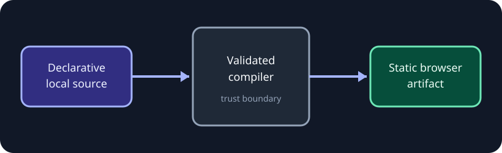

# Portable page architecture

**Fictional sample.** Every metric, status, organization, and decision on this page exists only to
demonstrate the report engine; replace it with verified project evidence before use.

This starter records one system decision in enough detail for implementation and later reversal. It keeps
the trust boundary visible instead of hiding it in framework code.

{{include: partials/decision.md}}

## Runtime flow

:::diagram{title="Offline compilation boundary" description="Declarative local input passes through validation and compile-time rendering into a static browser artifact." direction="right"}
::node{id="source" label="Local source" kind="accent"}
::node{id="model" label="Validated model" kind="neutral"}
::node{id="render" label="Semantic renderer" kind="success"}
::node{id="artifact" label="Static artifact" kind="accent"}
::edge{from="source" to="model" label="parse"}
::edge{from="model" to="render" label="typed data"}
::edge{from="render" to="artifact" label="HTML + assets"}
:::

## Alternatives

::::tabs{title="Alternatives considered"}
:::tab{label="Package primitives"}
One registry, model, renderer, and bounded runtime keep every supported page on the same contract.
:::
:::tab{label="Custom frontend"}
Maximum freedom, but every page owns framework setup, security review, accessibility, and packaging.
:::
:::tab{label="Hosted editor"}
Fast visual editing, but it introduces a service dependency and weakens offline portability.
:::
::::

## Operational consequences

::::cards
:::card{title="Positive"}
Authors provide data and semantic intent; the package owns browser behavior.
:::
:::card{title="Trade-off"}
New interaction classes require a package release instead of arbitrary author JavaScript.
:::
:::card{title="Guardrail"}
All filesystem references are confined before reads and all output works locally.
:::
::::

:::modal{title="Architecture review checklist" trigger="Open review checklist"}

- Does the source remain declarative?
- Is every local path confined before reading?
- Does the artifact work without a network or server?
- Is the new behavior covered at its public boundary?
  :::

## Rollout

:::steps{title="Adopt the decision"}

1. Validate the source model and diagnostics.
2. Render semantic output through the shared compiler.
3. Exercise the artifact through `file://` at desktop and mobile widths.
4. Revisit the decision when a verified requirement no longer fits the boundary.
   :::
