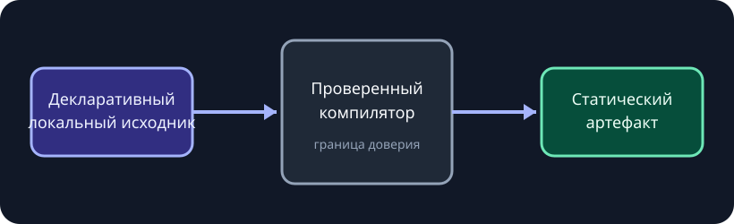

# Архитектура переносимой страницы

**Вымышленный пример.** Все метрики, статусы, организации и решения на этой странице нужны только для
демонстрации движка отчётов; перед использованием замените их проверенными данными проекта.

Эта основа фиксирует одно системное решение с достаточной детализацией для реализации и последующего отката.
Граница доверия остаётся видимой, а не скрывается в коде фреймворка.

{{include: partials/decision.ru.md}}

## Поток выполнения

:::diagram{title="Граница автономной сборки" description="Декларативный локальный вход проходит проверку и compile-time рендеринг и становится статическим браузерным артефактом." direction="right"}
::node{id="source" label="Локальный источник" kind="accent"}
::node{id="model" label="Проверенная модель" kind="neutral"}
::node{id="render" label="Смысловой рендерер" kind="success"}
::node{id="artifact" label="Статический артефакт" kind="accent"}
::edge{from="source" to="model" label="разбор"}
::edge{from="model" to="render" label="типизированные данные"}
::edge{from="render" to="artifact" label="HTML и ресурсы"}
:::

## Альтернативы

::::tabs{title="Рассмотренные альтернативы"}
:::tab{label="Примитивы пакета"}
Один реестр, модель, рендерер и ограниченный runtime удерживают все страницы на едином контракте.
:::
:::tab{label="Собственный frontend"}
Максимальная свобода, но каждая страница владеет настройкой фреймворка, безопасностью, доступностью и упаковкой.
:::
:::tab{label="Hosted-редактор"}
Быстрое визуальное редактирование, но появляется зависимость от сервиса и ослабевает автономная переносимость.
:::
::::

## Эксплуатационные последствия

::::cards
:::card{title="Плюс"}
Авторы задают данные и смысловое намерение; пакет владеет браузерным поведением.
:::
:::card{title="Компромисс"}
Новые классы взаимодействий требуют выпуска пакета вместо произвольного авторского JavaScript.
:::
:::card{title="Защитная граница"}
Все файловые ссылки ограничиваются до чтения, а весь результат работает локально.
:::
::::

:::modal{title="Чек-лист архитектурного ревью" trigger="Открыть чек-лист ревью"}

- Остаётся ли источник декларативным?
- Ограничивается ли каждый локальный путь до чтения?
- Работает ли артефакт без сети и сервера?
- Проверено ли новое поведение через публичную границу?
  :::

## Внедрение

:::steps{title="Применить решение"}

1. Проверить модель источника и диагностику.
2. Отрендерить смысловой результат через общий компилятор.
3. Проверить артефакт через `file://` на desktop и mobile.
4. Пересмотреть решение, когда проверенное требование перестанет укладываться в границу.
   :::
