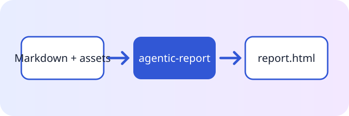

# Release decision report

**Fictional sample.** Every metric, status, organization, and decision on this page exists only to
demonstrate the report engine; replace it with verified project evidence before use.

This starter organizes a real review: the decision, the evidence behind it, the remaining risk, and the
next accountable steps. Replace the sample facts while keeping the semantic structure.

:::callout{kind="success" title="Recommendation"}
Proceed with the local release candidate. The documented first-use journey is complete and no blocking
defect remains in the reviewed scope.
:::

{{include: partials/findings.md}}

## Evidence map

::asset[Download the evidence map]{src="assets/architecture.svg"}

::::cards
:::card{title="Scope"}
The candidate includes the declarative authoring loop, static output, and package-owned interactions.
:::
:::card{title="Confidence"}
Focused unit, browser, and installed-package journeys cover the public path.
:::
:::card{title="Boundary"}
Publication and deployment remain separate external actions.
:::
::::

## Decision

:::decision{title="Accept the candidate for release preparation"}
The evidence supports advancing. Any new blocking observation reopens this decision with a reproducible
failure, owner, and next check.
:::

::::timeline{title="Evidence trail" description="Four accountable phases turn declarative source into a reviewed release decision."}
:::event{date="Author" title="State the decision" kind="neutral"}
Record the audience, scope, and success criteria in ordinary Markdown.
:::
:::event{date="Validate" title="Check the source" kind="accent"}
Run the production validation path before writing output.
:::
:::event{date="Build" title="Create the artifact" kind="success"}
Generate the portable page in the selected output format.
:::
:::event{date="Review" title="Inspect the result" kind="warning"}
Open the built file and record the decision against observed evidence.
:::
::::

## Review detail

:::disclosure{title="Open the residual-risk register" open="false"}

- Large embedded assets can exceed the configured warning threshold.
- External publication still requires an explicit release action.
- New requirements need their own evidence before they enter this decision.
  :::

## Next actions

:::steps{title="Complete the handoff"}

1. Replace the sample findings with verified project facts.
2. Run `agentic-report validate` and `agentic-report inspect`.
3. Build the selected output and open it directly in a browser.
4. Assign owners and dates to any residual action.
   :::

:::demo{title="Review confidence" start="1" step="1"}
Use this bounded control during a live review to count independently confirmed evidence groups.
:::
