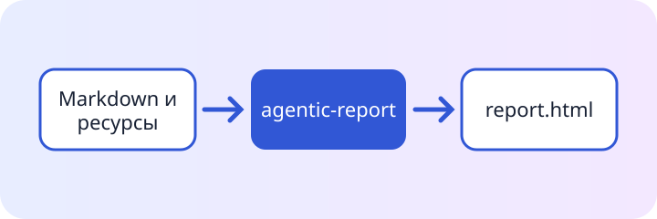

# Отчёт о решении по выпуску

**Вымышленный пример.** Все метрики, статусы, организации и решения на этой странице нужны только для
демонстрации движка отчётов; перед использованием замените их проверенными данными проекта.

Эта основа организует настоящее ревью: решение, подтверждающие его данные, оставшийся риск и следующие
ответственные шаги. Замените примерные факты, сохранив смысловую структуру.

:::callout{kind="success" title="Рекомендация"}
Продолжить работу с локальным кандидатом на выпуск. Сценарий первого использования завершён, а в
проверенном объёме нет блокирующих дефектов.
:::

{{include: partials/findings.ru.md}}

## Карта доказательств

::asset[Скачать карту доказательств]{src="assets/architecture.ru.svg"}

::::cards
:::card{title="Объём"}
Кандидат включает декларативный цикл подготовки, статический результат и встроенные взаимодействия пакета.
:::
:::card{title="Уверенность"}
Целевые unit-, браузерные и пакетные сценарии покрывают публичный путь.
:::
:::card{title="Граница"}
Публикация и развёртывание остаются отдельными внешними действиями.
:::
::::

## Решение

:::decision{title="Принять кандидата для подготовки выпуска"}
Доказательства позволяют двигаться дальше. Любое новое блокирующее наблюдение повторно открывает решение
вместе с воспроизводимым сбоем, владельцем и следующей проверкой.
:::

::::timeline{title="Цепочка доказательств" description="Четыре контролируемых этапа превращают декларативный источник в проверенное решение о выпуске."}
:::event{date="Автор" title="Сформулировать решение" kind="neutral"}
Зафиксировать аудиторию, объём и критерии успеха в обычном Markdown.
:::
:::event{date="Проверка" title="Проверить источник" kind="accent"}
Запустить production-путь проверки до записи результата.
:::
:::event{date="Сборка" title="Создать артефакт" kind="success"}
Сгенерировать переносимую страницу в выбранном формате.
:::
:::event{date="Ревью" title="Изучить результат" kind="warning"}
Открыть собранный файл и зафиксировать решение по наблюдаемым доказательствам.
:::
::::

## Подробности ревью

:::disclosure{title="Открыть реестр остаточных рисков" open="false"}

- Крупные встроенные ресурсы могут превысить настроенный порог предупреждения.
- Внешняя публикация всё ещё требует явного действия выпуска.
- Новым требованиям нужны собственные доказательства до включения в решение.
  :::

## Следующие действия

:::steps{title="Завершить передачу"}

1. Заменить примерные выводы проверенными фактами проекта.
2. Запустить `agentic-report validate` и `agentic-report inspect`.
3. Собрать выбранный формат и открыть его напрямую в браузере.
4. Назначить владельцев и даты всем оставшимся действиям.
   :::

:::demo{title="Уверенность ревью" start="1" step="1"}
Используйте этот ограниченный контрол во время живого ревью, чтобы считать независимо подтверждённые группы доказательств.
:::
