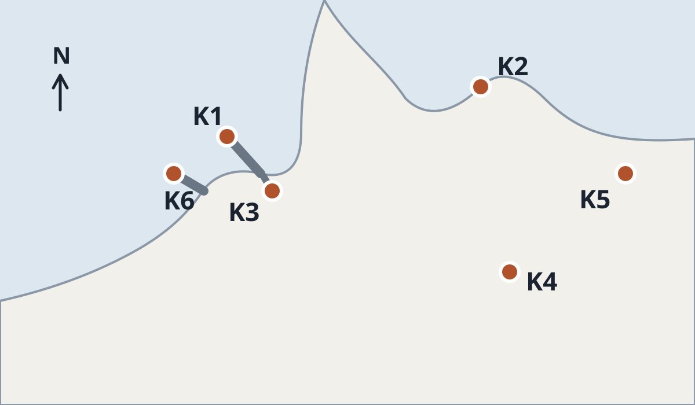

# Все приёмы agentic-report на примере одной сети станций

**Вымышленный пример.** Kestrel — выдуманная сеть из шести метеостанций на одном участке побережья, которую
волонтёры держат для гавани. Страница проходит с ней сезон 2026 года, по одному приёму на главу, и под
каждой главой показывает Markdown, из которого она собрана, чтобы нужную часть можно было скопировать.
Станции, показания и гавань придуманы, а каждый блок страницы пакет собирает из показанного исходника.

::contents

:::::::::section{title="Что измеряет Kestrel" id="words" nav="Слова в движении"}

:::lead
Каждые десять минут станции передают на страницу гавани :swap[ветер]{words="порывы, осадки, давление"}.
:::

Волонтёр подключает станцию одной командой, :typing[kestrel add K6 --site new-breakwater], а начальник
гавани попросил у сети одного: предупреждать о :term[штормовом ветре]{key="gale"} :mark[раньше]{shape="underline"},
чем он дойдёт до молов.

:::glossary{key="gale" term="Штормовой ветер" forms="штормового ветра, штормовому ветру, штормовым ветром, штормовом ветре"}
Ветер в 8 баллов по шкале Бофорта: средняя скорость от 34 до 40 узлов.
:::

```md
:::lead
Каждые десять минут станции передают на страницу гавани :swap[ветер]{words="порывы, осадки, давление"}.
:::

Волонтёр подключает станцию одной командой, :typing[kestrel add K6 --site new-breakwater], а начальник
гавани попросил у сети одного: предупреждать о :term[штормовом ветре]{key="gale"} :mark[раньше]{shape="underline"},
чем он дойдёт до молов.

:::glossary{key="gale" term="Штормовой ветер" forms="штормового ветра, штормовому ветру, штормовым ветром, штормовом ветре"}
Ветер в 8 баллов по шкале Бофорта: средняя скорость от 34 до 40 узлов.
:::
```

:::::::::

:::::::::section{title="Шесть станций из одной выгрузки" id="stations" nav="Данные из JSON"}

::expect{data="network.stations" count="6"}
::expect{data="network.stationCount" equals="6"}

В выгрузке, снятой :time[{{network.exportedAt}}]{zone="Europe/Lisbon"}, значится
:plural[{{network.stationCount}}]{forms="станция|станции|станций"}. Карточка написана один раз, а сборка
повторяет её для каждой станции из `data/network.json`.

:::::cards{title="Станции"}
::::each{in="network.stations" as="s"}
:::card{title="{{s.code}} · {{s.site.ru}}" status="{{s.card}}"}
{{s.note.ru}}; за сезон пришло {{s.uptime}} % ожидаемых сводок.
:::
::::
:::::

::source-line[Выгрузка Kestrel, {{network.reportsText.ru}} сводок от {{network.stationCount}} станций]{date="{{network.exportedAt}}" zone="Europe/Lisbon"}

Метаданные в начале файла называют его, а `expect` остановит сборку, если в выгрузке окажется не шесть станций.
Заполнитель с именем данных страницы подставляется и внутри блоков кода, поэтому листинг ниже без строки источника
и ограничен повторяемой карточкой: её `s` не имя данных.

```md
---
data:
  - data/network.json
---

::expect{data="network.stations" count="6"}
::expect{data="network.stationCount" equals="6"}

:::::cards{title="Станции"}
::::each{in="network.stations" as="s"}
:::card{title="{{s.code}} · {{s.site.ru}}" status="{{s.card}}"}
{{s.note.ru}}; за сезон пришло {{s.uptime}} % ожидаемых сводок.
:::
::::
:::::
```

:::::::::

:::::::::section{title="Список станций превращается в карточки на телефоне" id="roster" nav="Таблица карточками"}

Каждую строку списка читают отдельно, поэтому `layout="stack"` на узком экране делает из строки карточку,
где заголовки столбцов служат подписями. На широком экране это остаётся таблицей.

:::table{layout="stack"}

| Станция | Место                  | Высота мачты | Датчики                    |
| ------- | ---------------------- | ------------ | -------------------------- |
| K1      | Северный мол           | 8 м          | ветер, порывы, давление    |
| K2      | Маячный мыс            | 24 м         | ветер, порывы, видимость   |
| K3      | Рыбный причал          | 6 м          | ветер, осадки              |
| K4      | Школа у дюн            | 12 м         | ветер, осадки, температура |
| K5      | Домик береговой охраны | 18 м         | ветер, давление            |
| K6      | Новый волнолом         | 7 м          | ветер, волнение            |

:::

```md
:::table{layout="stack"}

| Станция | Место                  | Высота мачты | Датчики                    |
| ------- | ---------------------- | ------------ | -------------------------- |
| K1      | Северный мол           | 8 м          | ветер, порывы, давление    |
| K2      | Маячный мыс            | 24 м         | ветер, порывы, видимость   |
| K3      | Рыбный причал          | 6 м          | ветер, осадки              |
| K4      | Школа у дюн            | 12 м         | ветер, осадки, температура |
| K5      | Домик береговой охраны | 18 м         | ветер, давление            |
| K6      | Новый волнолом         | 7 м          | ветер, волнение            |

:::
```

:::::::::

:::::::::section{title="День ветра шире колонки" id="readings" nav="Широкая таблица"}

18 сентября средний ветер на K2 поднялся с 15 до 38 узлов и к ночи ослаб. K5 в таблице нет: станция молчит со
шторма 14 сентября. Показания сравнивают по строкам и часам, поэтому таблица сохраняет сетку с
`layout="scroll"`. На телефоне она прокручивается вбок, а код станции остаётся на месте; кнопка
**Открыть** показывает её на весь экран, и та же кнопка открывает любую диаграмму или график шире колонки.

::::table{layout="scroll"}
:::each{in="network.day.rows" as="r"}

| Станция    |     00:00 |     02:00 |     04:00 |     06:00 |     08:00 |     10:00 |     12:00 |     14:00 |     16:00 |     18:00 |     20:00 |     22:00 |
| ---------- | --------: | --------: | --------: | --------: | --------: | --------: | --------: | --------: | --------: | --------: | --------: | --------: |
| {{r.code}} | {{r.h00}} | {{r.h02}} | {{r.h04}} | {{r.h06}} | {{r.h08}} | {{r.h10}} | {{r.h12}} | {{r.h14}} | {{r.h16}} | {{r.h18}} | {{r.h20}} | {{r.h22}} |

:::
::::

::source-line[Выгрузка Kestrel, средний ветер в узлах каждые два часа, передают пять станций]{date="{{network.day.date}}"}

```md
::::table{layout="scroll"}
:::each{in="network.day.rows" as="r"}

| Станция    |     00:00 |     02:00 |     04:00 |     06:00 |     08:00 |     10:00 |     12:00 |     14:00 |     16:00 |     18:00 |     20:00 |     22:00 |
| ---------- | --------: | --------: | --------: | --------: | --------: | --------: | --------: | --------: | --------: | --------: | --------: | --------: |
| {{r.code}} | {{r.h00}} | {{r.h02}} | {{r.h04}} | {{r.h06}} | {{r.h08}} | {{r.h10}} | {{r.h12}} | {{r.h14}} | {{r.h16}} | {{r.h18}} | {{r.h20}} | {{r.h22}} |

:::
::::
```

Строки источника под этой таблицей и под графиком ниже называют данные страницы, поэтому
в листингах их нет.

:::::::::

:::::::::section{title="Сводки по месяцам, с отсчётом от нуля" id="month" nav="График"}

Сеть открылась в апреле с тремя станциями, а к сентябрю их стало шесть, поэтому рост месячного числа сводок
и есть новость сезона. `count-up` выращивает столбцы от нуля, когда график появляется на экране; при
уменьшенном движении они сразу стоят на своих значениях.

::::::chart{title="Сводки за месяц" description="Десятиминутные сводки, дошедшие до сервера Kestrel в каждом месяце сезона 2026 года; сентябрь посчитан за первые 20 дней." type="bar" x-label="Месяц 2026 года" y-label="Сводки" count-up="true"}
:::::series{label="Сводки"}
::::each{in="network.months" as="m"}
::point{label="{{m.label.ru}}" value="{{m.reports}}"}
::::
:::::
::::::

::source-line[Выгрузка Kestrel, {{network.reportsText.ru}} сводок за сезон]{date="{{network.exportedAt}}" zone="Europe/Lisbon"}

```md
::::::chart{title="Сводки за месяц" description="Десятиминутные сводки, дошедшие до сервера Kestrel в каждом месяце сезона 2026 года; сентябрь посчитан за первые 20 дней." type="bar" x-label="Месяц 2026 года" y-label="Сводки" count-up="true"}
:::::series{label="Сводки"}
::::each{in="network.months" as="m"}
::point{label="{{m.label.ru}}" value="{{m.reports}}"}
::::
:::::
::::::
```

:::::::::

:::::::::section{title="Сезон по датам" id="season" nav="Хроника"}

::::timeline{title="Сезон Kestrel 2026" description="Когда подключилась каждая станция и когда шторм заглушил K5."}
:::event{date="3 апреля 2026" title="Сеть открывается станциями K1, K2 и K4" kind="success"}
Три станции передают данные на страницу гавани с первого дня.
:::
:::event{date="10 мая 2026" title="K3 подключается на рыбном причале" kind="success"}
Самая низкая мачта сети, 6 метров над причалом.
:::
:::event{date="2 июня 2026" title="K5 подключается у домика береговой охраны" kind="success"}
Она прикрывает берег к востоку от маяка.
:::
:::event{date="12 сентября 2026" title="K6 подключается на новом волноломе" kind="success"}
Установку шестой станции показывает глава со сценой прокрутки ниже.
:::
:::event{date="14 сентября 2026" title="Шторм заглушает K5" kind="warning"}
Станция перестаёт передавать данные; волонтёр доберётся до неё, когда море успокоится.
:::
::legend-item{event="success" label="станции подключаются"}
::legend-item{event="warning" label="станция замолчала"}
::::

```md
::::timeline{title="Сезон Kestrel 2026" description="Когда подключилась каждая станция и когда шторм заглушил K5."}
:::event{date="3 апреля 2026" title="Сеть открывается станциями K1, K2 и K4" kind="success"}
Три станции передают данные на страницу гавани с первого дня.
:::
:::event{date="12 сентября 2026" title="K6 подключается на новом волноломе" kind="success"}
Установку шестой станции показывает глава со сценой прокрутки ниже.
:::
:::event{date="14 сентября 2026" title="Шторм заглушает K5" kind="warning"}
Станция перестаёт передавать данные; волонтёр доберётся до неё, когда море успокоится.
:::
::legend-item{event="success" label="станции подключаются"}
::legend-item{event="warning" label="станция замолчала"}
::::
```

В листинге нет двух событий из пяти: они записаны так же.

:::::::::

:::::::::section{title="Прошивка 2.4 дважды возвращалась" id="release" nav="Статусы и возвраты"}

Выпуск находится на шаге :process[План > Сборка > Полевое испытание > Отправка]{current="Полевое испытание" returns="Полевое испытание>Сборка×2"}.
Полевое испытание на K3 :mark[дважды]{shape="circle"} вернуло сборку, оба раза из-за соли в подшипнике
анемометра. Каждый узел несёт свой статус, который читается и без цвета, а «×2» на связи говорит, сколько
раз случился возврат.

:::diagram{title="Прошивка 2.4 на пути к станциям" description="План и сборка готовы; полевое испытание на K3 дважды вернуло сборку и идёт в третий раз; радиоразрешение один раз вернули; отправка ждёт обоих." layout="right"}
::node{id="plan" label="План" status="done"}
::node{id="build" label="Сборка" status="done"}
::node{id="field" label="Полевое испытание" detail="K3, рыбный причал" status="review"}
::node{id="radio" label="Радиоразрешение" status="returned"}
::node{id="ship" label="Отправка на станции" status="pending"}
::edge{from="plan" to="build"}
::edge{from="build" to="field"}
::edge{from="build" to="radio"}
::edge{from="field" to="build" label="соль в подшипнике" count="2"}
::edge{from="field" to="ship"}
::edge{from="radio" to="ship"}
:::

```md
Выпуск находится на шаге :process[План > Сборка > Полевое испытание > Отправка]{current="Полевое испытание" returns="Полевое испытание>Сборка×2"}.

:::diagram{title="Прошивка 2.4 на пути к станциям" description="План и сборка готовы; полевое испытание на K3 дважды вернуло сборку и идёт в третий раз; радиоразрешение один раз вернули; отправка ждёт обоих." layout="right"}
::node{id="plan" label="План" status="done"}
::node{id="build" label="Сборка" status="done"}
::node{id="field" label="Полевое испытание" detail="K3, рыбный причал" status="review"}
::node{id="radio" label="Радиоразрешение" status="returned"}
::node{id="ship" label="Отправка на станции" status="pending"}
::edge{from="plan" to="build"}
::edge{from="build" to="field"}
::edge{from="build" to="radio"}
::edge{from="field" to="build" label="соль в подшипнике" count="2"}
::edge{from="field" to="ship"}
::edge{from="radio" to="ship"}
:::
```

:::::::::

:::::::::section{title="Внутри сервера Kestrel" id="server" nav="Приближение узла"}

Показания идут от станций через один радиошлюз к серверу Kestrel. Сервер сам по себе небольшая схема,
поэтому у диаграммы есть `zoom`: пока диаграмма закреплена на экране, камера влетает в узел сервера, и на
его месте проступает внутреннее устройство. Без движения обе схемы стоят рядом.

::::diagram{title="От станции до страницы гавани" description="Станции отправляют показания через радиошлюз на сервер Kestrel, который публикует страницу гавани и хранит архив."}
::node{id="stations" label="Шесть станций"}
::node{id="gateway" label="Радиошлюз"}
::node{id="server" label="Сервер Kestrel"}
::node{id="page" label="Страница гавани"}
::node{id="archive" label="Архив"}
::edge{from="stations" to="gateway" label="каждые десять минут" kind="data"}
::edge{from="gateway" to="server" label="показания" kind="data"}
::edge{from="server" to="page" label="публикует"}
::edge{from="server" to="archive" label="сохраняет"}
:::zoom{node="server" title="Внутри сервера Kestrel"}
::node{id="intake" label="Приём"}
::node{id="check" label="Проверка качества"}
::node{id="publish" label="Публикация"}
::edge{from="intake" to="check"}
::edge{from="check" to="publish"}
:::
::::

```md
::::diagram{title="От станции до страницы гавани" description="Станции отправляют показания через радиошлюз на сервер Kestrel, который публикует страницу гавани и хранит архив."}
::node{id="stations" label="Шесть станций"}
::node{id="gateway" label="Радиошлюз"}
::node{id="server" label="Сервер Kestrel"}
::node{id="page" label="Страница гавани"}
::node{id="archive" label="Архив"}
::edge{from="stations" to="gateway" label="каждые десять минут" kind="data"}
::edge{from="gateway" to="server" label="показания" kind="data"}
::edge{from="server" to="page" label="публикует"}
::edge{from="server" to="archive" label="сохраняет"}
:::zoom{node="server" title="Внутри сервера Kestrel"}
::node{id="intake" label="Приём"}
::node{id="check" label="Проверка качества"}
::node{id="publish" label="Публикация"}
::edge{from="intake" to="check"}
::edge{from="check" to="publish"}
:::
::::
```

:::::::::

:::::::::section{title="Штормовое предупреждение, проигранное по шагам" id="gale" nav="Проигрываемая сцена"}

В 14:00 18 сентября станция на Маячном мысе измерила средний ветер, которого хватило для предупреждения о
:term[штормовом ветре]{key="gale"}. Сцена ниже по очереди проигрывает четыре строки журнала за эту минуту; каждый
шаг подсвечивает свою строку, а кнопка запускает сцену заново.

::::::demo{title="Штормовое предупреждение, 18 сентября, 14:00" play="time" seconds="3"}

```text
14:00:00  K2 lighthouse point  mean 38 kn  gust 44 kn
14:00:02  K2 logger            mean above 34 kn, flag GALE
14:00:05  server               GALE confirmed by K1, gust 41 kn
14:00:06  harbour page         gale warning shown for the moles
```

:::beat{title="Показание" lines="1"}
K2 измеряет средний ветер 38 узлов с порывами до 44 на Маячном мысе.
:::

:::beat{title="Отметка" lines="2"}
Регистратор станции помечает показание как штормовое.
:::

:::beat{title="Подтверждение" lines="3"}
Сервер ждёт вторую станцию, прежде чем поверить одному показанию.
:::

:::beat{title="Предупреждение" lines="4"}
Страница гавани показывает предупреждение через шесть секунд после показания.
:::
::::::

````md
::::::demo{title="Штормовое предупреждение, 18 сентября, 14:00" play="time" seconds="3"}

```text
14:00:00  K2 lighthouse point  mean 38 kn  gust 44 kn
14:00:02  K2 logger            mean above 34 kn, flag GALE
14:00:05  server               GALE confirmed by K1, gust 41 kn
14:00:06  harbour page         gale warning shown for the moles
```

:::beat{title="Показание" lines="1"}
K2 измеряет средний ветер 38 узлов с порывами до 44 на Маячном мысе.
:::

:::beat{title="Отметка" lines="2"}
Регистратор станции помечает показание как штормовое.
:::

:::beat{title="Подтверждение" lines="3"}
Сервер ждёт вторую станцию, прежде чем поверить одному показанию.
:::

:::beat{title="Предупреждение" lines="4"}
Страница гавани показывает предупреждение через шесть секунд после показания.
:::
::::::
````

:::::::::

:::::::::section{title="Станция K6 выходит на связь" id="mount" nav="Сцена прокрутки" scene="scrub"}

:::diagram{title="K6 входит в сеть" description="Датчики и регистратор K6 и сервер Kestrel." layout="right"}
::node{id="mast" label="Мачта и датчики"}
::node{id="logger" label="Регистратор"}
::node{id="server" label="Сервер Kestrel"}
::edge{from="mast" to="logger" kind="data"}
::edge{from="logger" to="server" kind="data"}
:::

:::beat{title="Мачта стоит" focus="mast"}
Волонтёры ставят семиметровую мачту на новом волноломе и крепят датчики ветра и волнения.
:::

:::beat{title="Регистратор на связи" focus="logger"}
Регистратор связывается с радиошлюзом на Маячном мысе.
:::

:::beat{title="Первое показание" focus="logger, server"}
12 сентября первое показание K6 доходит до сервера.
:::

:::::::::

:::::::::section{title="Как записана сцена прокрутки" id="mount-source" nav="Исходник сцены"}

У главы выше стоит `scene="scrub"`: диаграмма остаётся на экране, пока прокрутка проигрывает три шага, и каждый
шаг подсвечивает названные им узлы. На телефоне диаграмма стоит над подписью, по экрану на шаг.

```md
::::section{title="Станция K6 выходит на связь" id="mount" nav="Сцена прокрутки" scene="scrub"}

:::diagram{title="K6 входит в сеть" description="Датчики и регистратор K6 и сервер Kestrel." layout="right"}
::node{id="mast" label="Мачта и датчики"}
::node{id="logger" label="Регистратор"}
::node{id="server" label="Сервер Kestrel"}
::edge{from="mast" to="logger" kind="data"}
::edge{from="logger" to="server" kind="data"}
:::

:::beat{title="Мачта стоит" focus="mast"}
Волонтёры ставят семиметровую мачту на новом волноломе и крепят датчики ветра и волнения.
:::

:::beat{title="Регистратор на связи" focus="logger"}
Регистратор связывается с радиошлюзом на Маячном мысе.
:::

:::beat{title="Первое показание" focus="logger, server"}
12 сентября первое показание K6 доходит до сервера.
:::

::::
```

:::::::::

:::::::::section{title="Где стоят станции" id="map" nav="Картинка и лупа"}

Карта нарисована дважды, на светлом море и на тёмном, и `dark` называет второй файл: читатель видит
вариант той схемы, в которой открыта страница, а переключатель схемы меняет его на лету. `spotlight`
кладёт лупу на гавань, где три станции стоят рядом.

:::spotlight{x="31" y="42" zoom="1.5" title="Три станции стерегут гавань"}
{dark="assets/coast-dark.svg"}

K1 на Северном моле, K6 на новом волноломе и K3 у рыбного причала стоят в нескольких сотнях метров друг от
друга, поэтому порыв у входа в гавань доходит до всех трёх за минуту.
:::

```md
:::spotlight{x="31" y="42" zoom="1.5" title="Три станции стерегут гавань"}
{dark="assets/coast-dark.svg"}

K1 на Северном моле, K6 на новом волноломе и K3 у рыбного причала стоят в нескольких сотнях метров друг от
друга, поэтому порыв у входа в гавань доходит до всех трёх за минуту.
:::
```

:::::::::

:::::::::section{title="Сезон на четырёх экранах" id="screens" nav="Экраны и видео"}

У исходника одна раскладка, и этот обзор — документ. В метаданных отдельной страницы
[«Сезон Kestrel на четырёх экранах»](screens/index.html) стоит `layout: screens`, и один поворот колеса,
свайп или нажатие клавиши переводит ровно на один экран. Ролик
ниже снят, пока читатель листает эту страницу; `from` называет фильм, который записал
`agentic-screencast web`, с его кодировками и постером, а `dark-poster` даёт первый кадр в тёмной схеме.

::video{from="assets/film-ru" dark-poster="assets/season-poster-dark.ru.webp" caption="Страница из четырёх экранов, записанная, пока читатель её листает."}

```md
---
title: The Kestrel season in four screens
layout: screens
progress: nodes
theme: kestrel-theme.yaml
---

::video{from="assets/film-ru" dark-poster="assets/season-poster-dark.ru.webp" caption="Страница из четырёх экранов, записанная, пока читатель её листает."}
```

Первый блок — строки раскладки из метаданных в начале [`screens.md`](screens.md), без описания, языка
и локализаций; строка `video` стоит на этой странице.

:::::::::

:::::::::section{title="Итоги сезона слайдами" id="briefing" nav="Слайды в странице"}

В документ можно вставить несколько своих слайдов. Для встречи в гавани сезон уложен в три слайда: они —
часть этой страницы, собираются вместе с ней и открываются на весь экран кнопкой под ними.

:::::deck{title="Итоги сезона Kestrel" id="briefing-deck"}
::::slide

## Шесть станций, один сезон

Каждые десять минут, с апреля по сентябрь.
::::

::::slide{transition="push"}

## Что пошло не так

:::appear
Прошивку 2.4 дважды откатывали.
:::

:::appear{effect="fade"}
K5 замолчала после сентябрьского шторма.
:::

:::notes
Сказать, что ни одно штормовое предупреждение не пропало.
:::
::::

::::slide{transition="zoom"}

## Следующий сезон

Ещё две станции на северном пирсе.
::::
:::::

```md
:::::deck{title="Итоги сезона Kestrel" id="briefing-deck"}
::::slide

## Шесть станций, один сезон

Каждые десять минут, с апреля по сентябрь.
::::

::::slide{transition="push"}

## Что пошло не так

:::appear
Прошивку 2.4 дважды откатывали.
:::

:::appear{effect="fade"}
K5 замолчала после сентябрьского шторма.
:::

:::notes
Сказать, что ни одно штормовое предупреждение не пропало.
:::
::::

::::slide{transition="zoom"}

## Следующий сезон

Ещё две станции на северном пирсе.
::::
:::::
```

Слайд с шагами `appear` или заметками берёт ограду длиннее, чем у них, а колода — ещё длиннее.
`#briefing-deck/2` открывает второй слайд.

:::::::::

:::::::::section{title="Цвета бренда" id="theme" nav="Тема из бренда"}

Цвета Kestrel взяты у птицы: каштановая спина и сизая голова. `agentic-report theme` принял оба цвета,
сохранил их оттенок, сдвинул светлоту так, чтобы каждая контрастная пара проходила в обеих схемах, и
записал файл темы, которой пользуется эта страница. Каштановый стал акцентом, сизый — цветом надзаголовков;
в тёмной схеме цвет ссылок стал на шаг светлее.

```sh
agentic-report theme --colors "#b0532c,#4a6a8a" --extends daylight --output kestrel-theme.yaml
```

```yaml
name: kestrel-theme
extends: daylight
colors:
  light:
    accent: '#b0532c'
    accentStrong: '#b0532c'
    accentSoft: '#ffe9e1'
    accent2: '#4a6a8a'
  dark:
    accent: '#b0532c'
    accentStrong: '#c76841'
    accentSoft: '#411e0f'
    accent2: '#6081a2'
```

В листинге нет строки комментария и строк `description`, `palette`, `focus` и `chart1` из файла; страница называет его во
метаданных основной версии как `theme: kestrel-theme.yaml`.

:::::::::

:::::::::section{title="Заметки о поверке для тех, кому они нужны" id="notes" nav="Раскрытия и вкладки"}

Большинству читателей хватает результата поверки, а волонтёру, который обслуживает мачту, нужен способ.
Способ спрятан в раскрывающийся блок, а двум датчикам, которые проверяют по-разному, отведено по вкладке.

:::disclosure{title="Как проверяют анемометр Kestrel"}
Волонтёр десять минут сравнивает станцию с ручным анемометром на той же высоте. Если разница больше
2 узлов, датчик уходит в мастерскую.
:::

::::tabs{title="Проверка датчиков"}
:::tab{label="Ветер"}
Раз в сезон и после каждого шторма: чашки вращаются свободно, в подшипнике нет соли.
:::
:::tab{label="Осадки"}
Раз в месяц: воронку очищают от песка, а опрокидывающийся ковш проверяют отмеренным литром.
:::
::::

```md
:::disclosure{title="Как проверяют анемометр Kestrel"}
Волонтёр десять минут сравнивает станцию с ручным анемометром на той же высоте. Если разница больше
2 узлов, датчик уходит в мастерскую.
:::

::::tabs{title="Проверка датчиков"}
:::tab{label="Ветер"}
Раз в сезон и после каждого шторма: чашки вращаются свободно, в подшипнике нет соли.
:::
:::tab{label="Осадки"}
Раз в месяц: воронку очищают от песка, а опрокидывающийся ковш проверяют отмеренным литром.
:::
::::
```

Список глав в начале страницы — это `::contents` на отдельной строке: сборка пишет его из заголовков глав,
а метка `nav` каждой главы называет её в боковом оглавлении.

:::::::::

:::::::::section{title="Что изменилось с прошлой редакции" id="edition" nav="Изменения редакции"}

Волонтёры читают извещение об обслуживании K3 дважды: до второго полевого испытания и после него. Вторая
редакция собрана с `--since` и первой редакцией, поэтому страница отмечает изменения: вставленные и
удалённые слова, удалённый блок в виде свёрнутого призрака, изменённую строку кода и список «Изменения»
с переключателем, который их прячет.

```sh
agentic-report build edition-1.md --output notice.html
agentic-report build edition-2.md --output notice-2.html --since notice.html
```

Показать слой изменений на себе эта страница не может: пример собирается из одного исходника, без прошлой
редакции. Публичный сайт собирает извещение обоими способами, и пару можно открыть рядом:
[первая редакция](edition-1/index.html) и [вторая редакция с изменениями](edition-2/index.html).
Их исходники, [`edition-1.md`](edition-1.md) и [`edition-2.md`](edition-2.md), лежат рядом с этой страницей.

:::::::::
