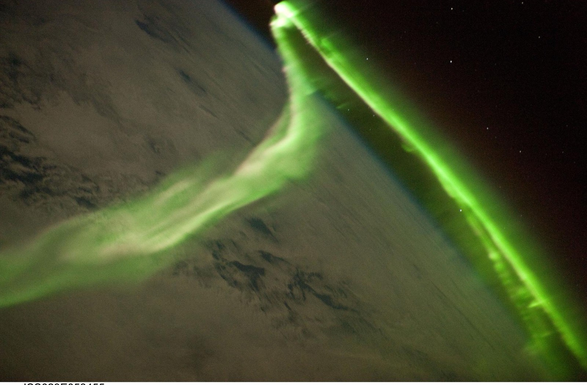
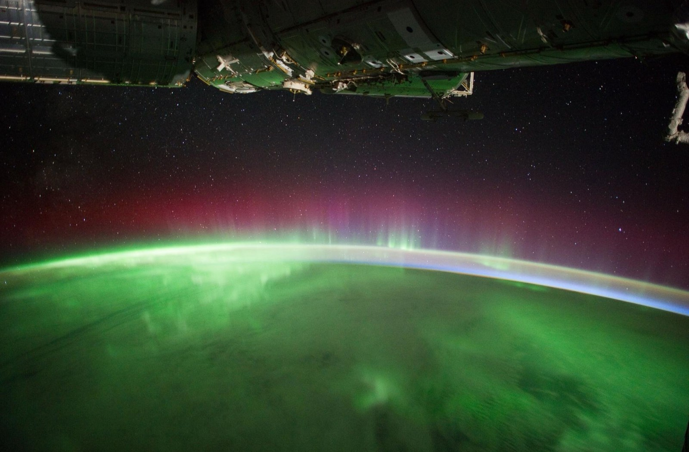

# After the last light

Crews of the International Space Station photograph Earth through the station's windows. Five of their
photographs, taken between 2001 and 2014, follow the planet from the desert by day to the aurora at night.
The photographs are NASA's and in the public domain; the captions give the crew, the date, and what the
frame shows.

::::actions{placement="edge"}
::action[Start on the night side]{href="#ridge" kind="primary"}
::action[Browse the frames]{href="#field-roll" kind="secondary"}
::::

::::::section{title="The night side" id="ridge" place="opening" nav="Night side" recipe="hero"}
:::lead
On 2 April 2014 an Expedition 39 crew member photographed Moscow at night. The city's radial highways glow
yellow at the lower left, a thin green line of the aurora borealis crosses the top, and the moon sits just
above it.
:::

The blue-white arc along the edge of the planet is airglow. Nizhny Novgorod shows 400 km east of Moscow, and
St Petersburg 625 km to the north-west.
::::::

::::::section{title="From desert to aurora" id="story" nav="Story" recipe="story"}

::::timeline{title="Where the crews looked" description="Four of the five frames, in the order they were taken."}
:::event{date="13 Apr 2001" title="Richat Structure, Mauritania" kind="neutral"}
Expedition 2 records the 40 km «bull's-eye» of uplifted, eroded rock on the Chinguetti plateau.
:::
:::event{date="25 Aug 2002" title="Calanscio Sand Sea, Libya" kind="neutral"}
Expedition 5 sees black smoke from a well-head flare drifting west across the linear dunes.
:::
:::event{date="29 May 2010" title="Aurora australis" kind="accent"}
Expedition 23 photographs the southern lights as green curtains below the station.
:::
:::event{date="2 Apr 2014" title="Moscow, aurora and moon" kind="success"}
Expedition 39 frames a city, an aurora and the moon in one night exposure.
:::
::legend-item{event="accent" label="Aurora"}
::legend-item{event="success" label="Opening photo"}
::::
::::::

::::::section{title="Frames" id="field-roll" nav="Frames" recipe="rail"}

::::::

::::::section{title="How far away" id="measure" nav="Scale" recipe="metrics"}
::::cards
:::card{title="About 390 km"}
Height of the station above Earth in 2012, as Expedition 31 engineer Don Pettit gave it (about 240 miles).
:::
:::card{title="40 km across"}
Width of the Richat Structure; its rings sit about 90 m below the plateau around them.
:::
:::card{title="625 km"}
Distance from Moscow to St Petersburg, both lit in the 2014 night frame.
:::
::::

Sources: the NASA Image and Video Library records ISS002-E-5457, ISS005-E-11189, ISS023-E-058455,
iss030e119777, ISS039-E-009160 and jsc2012e039800, which give the dates, places and measurements above.
::::::
