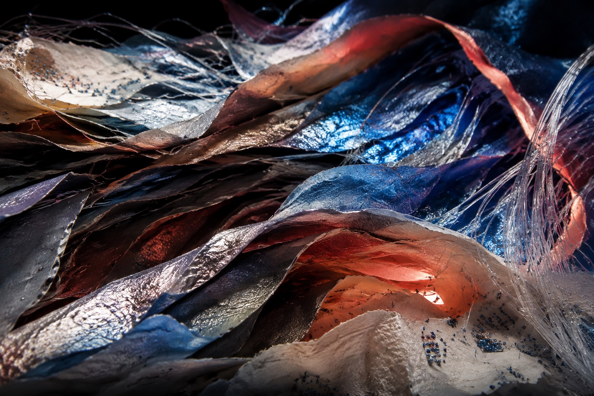
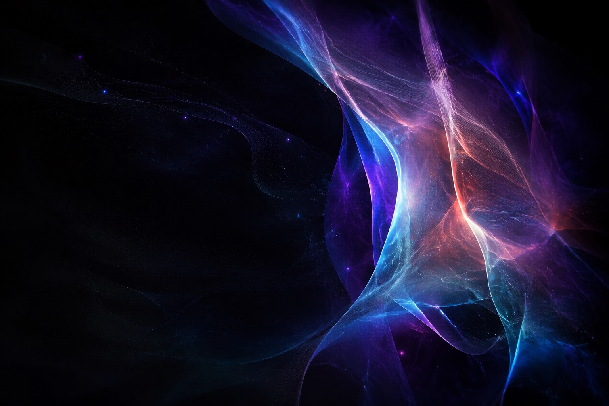
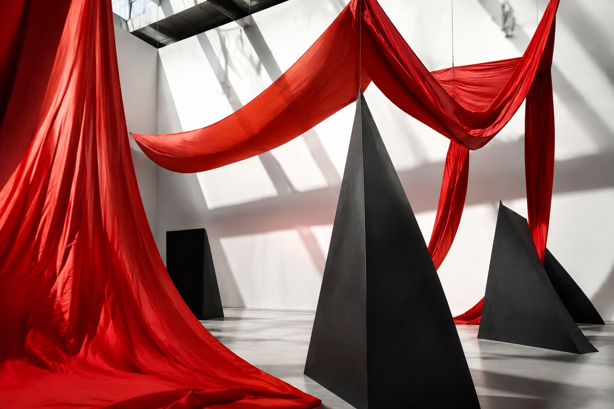

# После последнего света

**Вымышленный пример.** Это визуальное эссе показывает работу с локальными изображениями. Место, экспедиция
и наблюдения придуманы; замените их собственными материалами и проверенными данными.

Четыре кадра показывают путь исследовательской группы по меняющемуся хребту. Изображения ведут рассказ, а подписи
и наблюдения сохраняют его смысл без анимации.

::::actions{placement="edge"}
::action[Выйти на хребет]{href="#ridge" kind="primary" effect="magnetic"}
::action[Открыть полевую ленту]{href="#field-roll" kind="secondary"}
::::

::::::section{title="Хребет просыпается" id="ridge" nav="Хребет" recipe="hero"}
:::lead
В 05:40 восточный склон ловит первый свет. Короткое погодное окно даёт группе один непрерывный проход по
верхней полке до возвращения облаков.
:::

:::callout{kind="info" title="О сцене"}
Пакет управляет кадрированием, глубиной и появлением элементов, а при системном запрете анимации отключает
движение. Источник передаёт одно
локальное изображение и его смысл.
:::
::::::

::::::section{title="Три изменения высоты" id="story" nav="История" recipe="story"}

::::timeline{title="Переход" description="Последовательность связывает видимые изменения рельефа с решениями группы."}
:::event{date="06:15" title="Нижняя полка" kind="neutral"}
Осыпь смещает первый маршрут на двадцать метров севернее намеченной линии.
:::
:::event{date="07:05" title="Средний склон" kind="accent"}
Под швом, который из долины казался сухим, обнаруживаются свежие следы воды.
:::
:::event{date="08:20" title="Верхний хребет" kind="success"}
Ветер ненадолго разгоняет облака: группа завершает последнюю панораму и закрывает маршрут.
:::
::::
::::::

::::::section{title="Полевая лента" id="field-roll" nav="Кадры" recipe="rail"}

::::cards
:::card{title="Кадр 01 · Погода"}
Холодный свет фиксирует край облаков до начала перехода.
:::
:::card{title="Кадр 02 · Материал"}
Красная поверхность открывает рисунок трещин, неразличимый на нижнем подходе.
:::
:::card{title="Кадр 03 · Масштаб" href="#measure"}
Откройте итоговые измерения, которые завершают историю.
:::
::::
::::::

::::::section{title="Что группа увозит домой" id="measure" nav="Итог" recipe="metrics"}
::::cards
:::card{title="4 локальных кадра"}
Все изображения входят в отчёт; собранная страница не запрашивает медиа из сети.
:::
:::card{title="1 непрерывная история"}
Прокрутка меняет акцент, а исходный порядок и режим без движения сохраняют полный рассказ.
:::
:::card{title="2 формата результата"}
Для компактной передачи подходит один HTML, для крупных медиа — каталог с адресуемыми ресурсами.
:::
::::

:::decision{title="Изображения задают структуру"}
Кинематографическое направление подходит, когда серия собственных изображений служит доказательством,
контекстом или темой. Для декоративных картинок лучше выбрать обычное отчётное оформление.
:::
::::::
