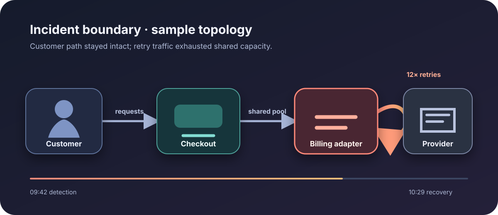

# OrbitDesk P1 incident review

**Fictional showcase · 18 July 2026 · final review**

This demonstration follows a realistic incident at OrbitDesk, an invented subscription platform. Every
organization, event, metric, and decision on this page is sample data created to show the report engine;
none describes a real company or production system.

:::callout{kind="warning" title="Executive readout"}
A retry storm in the billing adapter exhausted the checkout connection pool for 47 minutes. Customer
records remained intact, but **18.4% of checkout attempts failed** at peak and **3,240 renewals were
delayed**. Traffic shaping restored service before the adapter fix was deployed.
:::

::::cards
:::card{title="Customer impact"}
**18.4% peak failures**

Checkout errors were elevated from `09:42` to `10:29 UTC`.
:::
:::card{title="Recovery"}
**47 minutes**

The error budget stopped burning after retry traffic was capped.
:::
:::card{title="Data integrity"}
**No loss found**

Ledger reconciliation matched all accepted payment events.
:::
:::card{title="Follow-up"}
**4 owned actions**

Two prevention items, one detection improvement, and one preparedness drill are tracked below.
:::
::::

## Impact curve

:::::chart{type="line" title="Failed checkout attempts" description="Sample checkout failure percentage rose sharply during retry saturation and returned near baseline after traffic shaping." x-label="UTC checkpoint" y-label="Failed attempts, percent"}
::::series{label="Failure rate"}
::point{label="09:35" value="0.6"}
::point{label="09:50" value="8.7"}
::point{label="10:05" value="18.4"}
::point{label="10:20" value="7.2"}
::point{label="10:35" value="0.8"}
::::
:::::

## What failed

:::diagram{title="Causal chain" description="A provider timeout triggered uncapped adapter retries, saturated the shared connection pool, and caused checkout failures." direction="down"}
::node{id="timeout" label="Provider timeout" kind="warning"}
::node{id="retry" label="Retry amplification" kind="warning"}
::node{id="pool" label="Pool saturation" kind="accent"}
::node{id="checkout" label="Checkout failure" kind="neutral"}
::edge{from="timeout" to="retry" label="replayed calls"}
::edge{from="retry" to="pool" label="12× traffic"}
::edge{from="pool" to="checkout" label="no connections"}
:::

::::tabs{title="Evidence and limits"}
:::tab{label="Confirmed"}

- Billing adapter retries rose twelvefold before checkout saturation.
- Pool wait time, not database latency, tracked the customer error curve.
- Limiting retries reduced errors before any application deployment.
  :::
  :::tab{label="Hypotheses"}

- **H1 — supported:** uncapped billing retries amplified the provider timeout and exhausted the shared pool.
- **H2 — rejected:** a database regression caused checkout failures; database latency stayed normal while pool waits rose.
- **H3 — rejected:** a release changed checkout behavior; no deployment, migration, or flag change occurred in the incident window.
- **H4 — open:** an external provider fault caused the nine-minute timeout; provider evidence is still pending.
  :::
  :::tab{label="Ruled out"}

- Ledger and order-store writes remained within their normal latency bands.
- No schema migration or feature flag changed during the incident window.
- Reconciliation found no duplicated accepted payment event.
  :::
  :::tab{label="Still unknown"}
  The sample review cannot establish why the provider timeout lasted nine minutes; that question belongs to
  the external-provider review and does not change the verified internal amplification mechanism.
  :::
  ::::

## Response timeline

::::timeline{title="Incident command log" description="Five sample checkpoints show detection, diagnosis, mitigation, recovery, and verification."}
:::event{date="09:42 UTC" title="Alert fired" kind="warning"}
Checkout success dropped below the 98% service objective; the incident commander declared P1.
:::
:::event{date="09:51 UTC" title="Failure isolated" kind="accent"}
The team correlated checkout connection waits with retry volume from the billing adapter.
:::
:::event{date="10:12 UTC" title="Retries capped" kind="accent"}
Traffic policy limited adapter retries and shed non-critical reconciliation work.
:::
:::event{date="10:29 UTC" title="Service recovered" kind="success"}
Checkout success held above 99% for ten minutes and the incident moved to monitoring.
:::
:::event{date="13:00 UTC" title="Integrity verified" kind="success"}
Payment, order, and ledger totals reconciled with no loss or duplicate acceptance.
:::
::::

## Corrective action register

{{include: partials/actions.md}}

:::decision{title="Keep the shared pool; remove unbounded retries"}
The evidence does not justify splitting the billing adapter into a new service. OrbitDesk will keep the
existing boundary, enforce a retry budget with jitter, reserve checkout pool capacity, and alert on retry
amplification. The decision is reversible if load testing shows isolation is still required.
:::

:::disclosure{title="Open the customer communication draft" open="false"}
Between `09:42` and `10:29 UTC`, some fictional OrbitDesk customers could not complete checkout. Existing
subscriptions and stored records remained safe. Service is restored, delayed renewals have been replayed,
and safeguards are being added to prevent retry traffic from exhausting checkout capacity.
:::

## Exit criteria

:::steps{title="Close the review"}

1. Replay the production-shaped retry scenario in load testing.
2. Confirm checkout capacity remains available during provider timeouts.
3. Exercise the new amplification alert in the incident drill.
4. Close each action only with linked, reproducible evidence.
   :::
