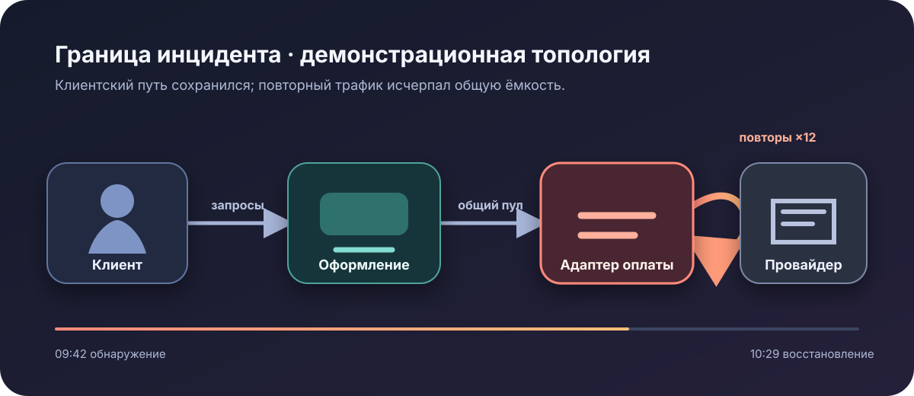

# Разбор инцидента P1 в OrbitDesk

**Вымышленный пример · 18 июля 2026 года · итоговый разбор**

Эта демонстрация описывает реалистичный инцидент в вымышленной платформе подписок OrbitDesk. Все организации,
события, показатели и решения на странице — демонстрационные данные для движка отчётов; они не описывают
реальную компанию или производственную систему.

::::::section{title="Сигнал влияния" id="impact" nav="Влияние" width="wide" align="start" tone="contrast" composition="stage" viewport="full" section-density="immersive" type="display" media="mask" media-fit="cover" media-aspect="cinematic" focal="right" surface="mesh" transition="stagger" scene="progress" choreography="cascade"}
:::callout{kind="warning" title="Сводка для руководства"}
Шторм повторных запросов в адаптере оплаты на 47 минут исчерпал пул соединений оформления заказа. Данные
клиентов сохранились, но на пике **18,4% попыток оформления завершались ошибкой**, а **3 240 продлений были
задержаны**. Управление трафиком восстановило сервис до развёртывания исправления адаптера.
:::

::::cards
:::card{title="Влияние на клиентов"}
**18,4% ошибок на пике**

Число ошибок оформления было повышено с `09:42` до `10:29 UTC`.
:::
:::card{title="Восстановление"}
**47 минут**

Расход бюджета ошибок прекратился после ограничения повторного трафика.
:::
:::card{title="Целостность данных"}
**Потерь не найдено**

Сверка реестра совпала со всеми принятыми событиями оплаты.
:::
:::card{title="Последующие действия"}
**4 действия с владельцами**

Ниже отслеживаются два пункта профилактики, одно улучшение обнаружения и одна тренировка готовности.
:::
::::

## Кривая влияния

:::::chart{type="line" title="Неудачные попытки оформления" description="Демонстрационная доля ошибок оформления резко выросла при насыщении повторами и вернулась почти к базовой после управления трафиком." x-label="Контрольная точка UTC" y-label="Неудачные попытки, проценты"}
::::series{label="Доля ошибок"}
::point{label="09:35" value="0.6"}
::point{label="09:50" value="8.7"}
::point{label="10:05" value="18.4"}
::point{label="10:20" value="7.2"}
::point{label="10:35" value="0.8"}
::::
:::::

::::::

:::::section{title="Что отказало" id="cause" nav="Причина" width="wide" align="start" tone="soft" composition="split" viewport="bounded" section-density="editorial" type="editorial" surface="grid" transition="stagger" choreography="cascade"}

:::diagram{title="Причинная цепочка" description="Тайм-аут провайдера вызвал неограниченные повторы адаптера, насытил общий пул соединений и привёл к ошибкам оформления." direction="down"}
::node{id="timeout" label="Тайм-аут провайдера" kind="warning"}
::node{id="retry" label="Усиление повторов" kind="warning"}
::node{id="pool" label="Насыщение пула" kind="accent"}
::node{id="checkout" label="Ошибка оформления" kind="neutral"}
::edge{from="timeout" to="retry" label="повтор вызовов"}
::edge{from="retry" to="pool" label="трафик ×12"}
::edge{from="pool" to="checkout" label="нет соединений"}
:::

::::tabs{title="Данные и ограничения"}
:::tab{label="Подтверждено"}

- Число повторов адаптера оплаты выросло в двенадцать раз до насыщения оформления.
- Кривая клиентских ошибок следовала за ожиданием пула, а не за задержкой базы данных.
- Ограничение повторов снизило ошибки до развёртывания приложения.
  :::
  :::tab{label="Гипотезы"}

- **Г1 — подтверждена:** неограниченные повторы оплаты усилили тайм-аут провайдера и исчерпали общий пул.
- **Г2 — отклонена:** ошибки вызвала регрессия базы; задержка базы оставалась нормальной при росте ожидания пула.
- **Г3 — отклонена:** релиз изменил оформление; в окне инцидента не было развёртываний, миграций или флагов.
- **Г4 — открыта:** внешний сбой провайдера вызвал девятиминутный тайм-аут; данные провайдера ожидаются.
  :::
  :::tab{label="Исключено"}

- Записи реестра и хранилища заказов оставались в нормальных диапазонах задержки.
- В окне инцидента не менялись миграции схемы и флаги функций.
- Сверка не нашла дубликатов принятых событий оплаты.
  :::
  :::tab{label="Пока неизвестно"}
  Демонстрационный разбор не устанавливает причину девятиминутного тайм-аута провайдера. Это вопрос внешнего
  разбора, не меняющий подтверждённый внутренний механизм усиления.
  :::
  ::::

:::::

:::::section{title="Хронология реагирования" id="response" nav="Реагирование" width="wide" align="start" tone="plain" composition="stack" viewport="adaptive" section-density="compact" type="body" surface="plain" transition="reveal" choreography="cascade"}

::::timeline{title="Журнал управления инцидентом" description="Пять демонстрационных точек показывают обнаружение, диагностику, смягчение, восстановление и проверку."}
:::event{date="09:42 UTC" title="Сработало оповещение" kind="warning"}
Успешность оформления упала ниже цели сервиса 98%; руководитель объявил P1.
:::
:::event{date="09:51 UTC" title="Отказ локализован" kind="accent"}
Команда сопоставила ожидание соединений оформления с объёмом повторов адаптера оплаты.
:::
:::event{date="10:12 UTC" title="Повторы ограничены" kind="accent"}
Политика трафика ограничила повторы адаптера и сбросила некритичную работу сверки.
:::
:::event{date="10:29 UTC" title="Сервис восстановлен" kind="success"}
Успешность оформления десять минут держалась выше 99%, и инцидент перешёл в наблюдение.
:::
:::event{date="13:00 UTC" title="Целостность проверена" kind="success"}
Итоги оплаты, заказов и реестра сошлись без потерь и повторного принятия.
:::
::::
:::::

:::::section{title="Реестр корректирующих действий" id="actions" nav="Действия" width="wide" align="start" tone="accent" composition="mosaic" viewport="bounded" section-density="editorial" type="editorial" surface="glow" transition="stagger" choreography="cascade"}

{{include: partials/actions.ru.md}}

:::decision{title="Сохранить общий пул; убрать неограниченные повторы"}
Данные не обосновывают выделение адаптера оплаты в новый сервис. OrbitDesk сохранит существующую границу,
введёт бюджет повторов со случайной задержкой, зарезервирует ёмкость пула для оформления и добавит оповещение
об усилении повторов. Решение обратимо, если нагрузочное тестирование всё же покажет необходимость изоляции.
:::

:::disclosure{title="Открыть черновик сообщения клиентам" open="false"}
С `09:42` до `10:29 UTC` часть вымышленных клиентов OrbitDesk не могла завершить оформление. Существующие
подписки и записи оставались в безопасности. Сервис восстановлен, задержанные продления воспроизведены,
добавляются защиты от исчерпания ёмкости оформления повторным трафиком.
:::

## Критерии выхода

:::steps{title="Закрыть разбор"}

1. Воспроизведите сценарий повторов с производственным профилем в нагрузочном тесте.
2. Подтвердите доступность ёмкости оформления при тайм-аутах провайдера.
3. Проверьте новое оповещение об усилении на тренировке инцидента.
4. Закрывайте каждое действие только со ссылкой на воспроизводимое доказательство.
   :::

:::::
