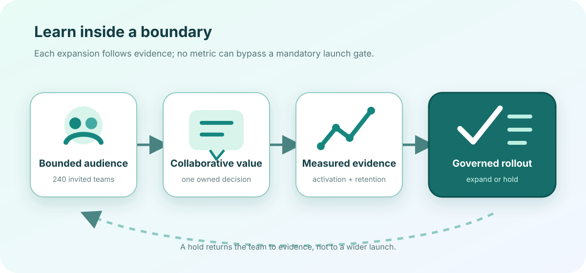

# Regional beta launch readiness

**Fictional showcase · 19 August 2026 · conditional go**

This brief follows a fictional launch review for **Driftwood Rooms**, an invented collaborative planning
product from the fictional North Quay Labs. Every user, cohort, metric, threshold, and date is sample data
created for the report engine; none describes a real product, company, or market result.

:::callout{kind="success" title="Decision in one minute"}
Open a 240-team European Economic Area beta on 15 September. Keep the invitation list capped, exclude
regulated workflows, and hold broader expansion until week-two retention and support-response gates pass for
two consecutive cohorts.
:::

::::cards
:::card{title="Audience"}
**240 invited teams**

Design, research, and operations groups coordinating recurring decisions.
:::
:::card{title="Activation"}
**64% · target ≥ 60%**

Teams that created a room, assigned an owner, and closed one decision in seven days.
:::
:::card{title="Week-two retention"}
**54% · target ≥ 50%**

Activated teams returning with at least two collaborators.
:::
:::card{title="Launch blockers"}
**0 open · target 0**

No unresolved severity-one issue or missing mandatory launch gate.
:::
::::

## Who gets value first

::::tabs{title="Audience evidence"}
:::tab{label="Product teams"}
Weekly planning rooms replace scattered status threads with one decision, owner, and review date. In the
fictional research sample, 18 of 24 activated product teams closed a decision during their first week.
:::
:::tab{label="Operations teams"}
Handoff rooms keep exceptions, accountable owners, and exit conditions together. Eleven of 16 activated
operations teams returned for a second workflow without facilitator help.
:::
:::tab{label="Residual risk"}
Single-participant rooms show weak repeat value, and mobile attachment review remains slower than desktop.
The beta excludes regulated casework and makes no claim about enterprise-wide adoption.
:::
::::

## Activation evidence

::::chart{type="line" title="Activated workspace rate by cohort" description="The fictional seven-day activated workspace rate rises from 46 percent in cohort one to 64 percent in cohort four." x-label="Design-partner cohort" y-label="Activated workspaces, percent"}
:::series{label="Activated within seven days"}
::point{label="Cohort 1" value="46"}
::point{label="Cohort 2" value="52"}
::point{label="Cohort 3" value="59"}
::point{label="Cohort 4" value="64"}
:::
::::

::::chart{type="bar" title="Design-partner funnel" description="Of 320 fictional invited teams, 228 accepted, 146 activated, and 79 were retained in week two." x-label="Funnel stage" y-label="Teams"}
:::series{label="Teams"}
::point{label="Invited" value="320"}
::point{label="Accepted" value="228"}
::point{label="Activated" value="146"}
::point{label="Week-two retained" value="79"}
:::
::::

| Decision signal               | Launch threshold | Observed sample | Assessment |
| ----------------------------- | ---------------: | --------------: | ---------- |
| Seven-day activation          |            ≥ 60% |             64% | Pass       |
| Week-two retained teams       |            ≥ 50% |             54% | Pass       |
| Median room setup             |          ≤ 8 min |           6 min | Pass       |
| Severity-one product issues   |                0 |               0 | Pass       |
| Rehearsed support first reply |         ≤ 10 min |           7 min | Pass       |

## Launch gates and ownership

{{include: partials/readiness-register.md}}

:::popover{title="Regional boundary" trigger="Why not launch globally?"}
The fictional evidence covers one language set, one support rotation, and European Economic Area data
handling. A wider launch would change the operating model and invalidate the current capacity and retention
assumptions.
:::

:::toggle{title="Automatic hold condition" label="Show the automatic hold condition" default="off"}
Pause new invitations if week-two retention falls below 50% in either of the first two beta cohorts, support
first reply exceeds 10 minutes during two rehearsals, or any mandatory gate loses current evidence.
:::

:::disclosure{title="Read the experiment limits" open="false"}
The sample uses invited design partners rather than a random market sample. Activation and retention are
directional operating thresholds, not statistical proof of product-market fit. The cohort trend includes no
seasonality adjustment, and the funnel does not estimate paid conversion.
:::

## Decision and rollout

:::decision{title="Go: bounded European Economic Area beta"}
Launch on 15 September for no more than 240 invited teams. Product Operations owns the invitation cap;
Trust owns the weekly data-handling check; Support owns the response rehearsal. Hold expansion when any
mandatory gate fails or either automatic hold condition is reached. A go decision for this beta is not an
approval for general availability.
:::

::::timeline{title="Reversible beta path" description="Four fictional checkpoints separate evidence lock, bounded access, retention review, and any expansion decision."}
:::event{date="05 Sep" title="Evidence locked" kind="accent"}
Freeze gate evidence, experiment definitions, invitation owners, and the support escalation tree.
:::
:::event{date="15 Sep" title="Bounded beta opens" kind="success"}
Invite the first 80 teams with regulated workflows disabled and daily support review enabled.
:::
:::event{date="29 Sep" title="Two-week evidence reviewed" kind="warning"}
Compare activation, retained teams, incident state, and support response with the written thresholds.
:::
:::event{date="13 Oct" title="Expand or hold" kind="accent"}
Add the remaining invitations only after two passing cohorts; otherwise stop intake and close the learning loop.
:::
::::

:::steps{title="Run the launch review"}

1. Confirm every gate has a current owner, evidence date, and failing consequence.
2. Recalculate activation and retention from the frozen cohort definitions.
3. Exercise the support escalation and invitation-pause controls before opening access.
4. Record the expand-or-hold decision with the evidence that changed it.
   :::
