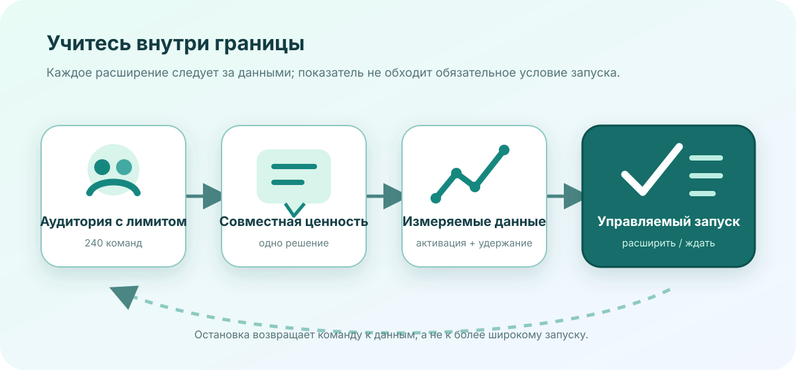

# Готовность региональной беты к запуску

**Вымышленный пример · 19 августа 2026 года · условное одобрение**

Эта записка описывает вымышленный запуск **Driftwood Rooms** — придуманного продукта совместного планирования
от вымышленной North Quay Labs. Все пользователи, когорты, показатели, пороги и даты созданы для движка
отчётов; они не описывают реальный продукт, компанию или рыночный результат.

:::::section{title="Сигнал запуска" id="launch-signal" nav="Сигнал" width="wide" align="start" tone="contrast" composition="stage" viewport="full" section-density="immersive" type="display" media="mask" media-fit="cover" media-aspect="cinematic" focal="right" surface="mesh" transition="stagger" scene="progress" choreography="cascade"}
:::callout{kind="success" title="Решение за минуту"}
15 сентября открыть бета-тест для 240 команд Европейской экономической зоны. Ограничить список приглашений,
исключить регулируемые процессы и не расширять запуск, пока условия удержания на второй неделе и ответа
поддержки не будут пройдены двумя когортами подряд.
:::

::::cards
:::card{title="Аудитория"}
**240 приглашённых команд**

Группы дизайна, исследований и операций, координирующие повторяющиеся решения.
:::
:::card{title="Активация"}
**64% · цель ≥ 60%**

Команды, создавшие комнату, назначившие владельца и закрывшие одно решение за семь дней.
:::
:::card{title="Удержание на второй неделе"}
**54% · цель ≥ 50%**

Активированные команды, вернувшиеся как минимум с двумя участниками.
:::
:::card{title="Блокеры запуска"}
**0 открытых · цель 0**

Нет нерешённых проблем первой критичности или отсутствующего обязательного условия запуска.
:::
::::

:::::

:::::section{title="Кто первым получает пользу" id="audience" nav="Аудитория" width="wide" align="start" tone="soft" composition="mosaic" viewport="bounded" section-density="compact" type="editorial" surface="grain" transition="stagger" choreography="cascade"}

::::tabs{title="Данные об аудитории"}
:::tab{label="Продуктовые команды"}
Еженедельные комнаты планирования заменяют разрозненные ветки статусов единым решением, владельцем и датой
ревью. В вымышленной выборке 18 из 24 активированных продуктовых команд закрыли решение в первую неделю.
:::
:::tab{label="Операционные команды"}
Комнаты передачи хранят исключения, ответственных владельцев и условия выхода вместе. Одиннадцать из шестнадцати
активированных операционных команд вернулись ко второму процессу без помощи фасилитатора.
:::
:::tab{label="Остаточный риск"}
Комнаты с одним участником показывают слабую повторную ценность, а просмотр мобильных вложений медленнее
компьютерного. Бета исключает регулируемые дела и не заявляет внедрение во всей организации.
:::
::::
:::::

:::::section{title="Данные активации" id="activation" nav="Данные" width="wide" align="start" tone="plain" composition="split" viewport="bounded" section-density="editorial" type="display" surface="grid" transition="reveal" scene="progress" choreography="cascade"}

::::chart{type="line" title="Доля активированных рабочих пространств по когортам" description="Вымышленная семидневная доля активации растёт с 46 процентов в первой когорте до 64 в четвёртой." x-label="Когорта дизайн-партнёров" y-label="Активированные пространства, проценты"}
:::series{label="Активированы за семь дней"}
::point{label="Когорта 1" value="46"}
::point{label="Когорта 2" value="52"}
::point{label="Когорта 3" value="59"}
::point{label="Когорта 4" value="64"}
:::
::::

::::chart{type="bar" title="Воронка дизайн-партнёров" description="Из 320 вымышленных приглашённых команд 228 приняли приглашение, 146 активировались, а 79 удержались на второй неделе." x-label="Этап воронки" y-label="Команды"}
:::series{label="Команды"}
::point{label="Приглашены" value="320"}
::point{label="Приняли" value="228"}
::point{label="Активировались" value="146"}
::point{label="Удержались на второй неделе" value="79"}
:::
::::

| Сигнал решения              | Порог запуска | Наблюдаемая выборка | Оценка   |
| --------------------------- | ------------: | ------------------: | -------- |
| Семидневная активация       |         ≥ 60% |                 64% | Пройдено |
| Удержание на второй неделе  |         ≥ 50% |                 54% | Пройдено |
| Медиана настройки комнаты   |       ≤ 8 мин |               6 мин | Пройдено |
| Проблемы первой критичности |             0 |                   0 | Пройдено |
| Первый ответ поддержки      |      ≤ 10 мин |               7 мин | Пройдено |

:::::

:::::section{title="Условия запуска и владельцы" id="gates" nav="Условия" width="wide" align="start" tone="accent" composition="story" viewport="adaptive" section-density="editorial" type="editorial" surface="glow" transition="reveal"}

{{include: partials/readiness-register.ru.md}}

:::popover{title="Региональная граница" trigger="Почему не глобальный запуск?"}
Вымышленные данные охватывают один набор языков, одну смену поддержки и обработку данных Европейской
экономической зоны. Более широкий запуск изменит операционную модель и сделает текущие допущения о ёмкости
и удержании недействительными.
:::

:::toggle{title="Условие автоматической остановки" label="Показать условие автоматической остановки" default="off"}
Приостановить новые приглашения, если удержание второй недели ниже 50% в любой из первых двух когорт,
первый ответ поддержки дольше 10 минут на двух репетициях или обязательное условие теряет актуальные данные.
:::

:::disclosure{title="Прочитать ограничения эксперимента" open="false"}
В примере участвуют приглашённые дизайн-партнёры, а не случайная рыночная выборка. Активация и удержание —
направляющие операционные пороги, не статистическое доказательство соответствия рынку. Тренд когорт не
скорректирован по сезонности, а воронка не оценивает платную конверсию.
:::
:::::

:::::section{title="Решение и развёртывание" id="rollout" nav="Развёртывание" width="wide" align="start" tone="contrast" composition="stack" viewport="bounded" section-density="compact" type="display" surface="mesh" transition="stagger" choreography="cascade"}

:::decision{title="Одобрить ограниченную бету в Европейской экономической зоне"}
Запустить 15 сентября максимум для 240 приглашённых команд. Продуктовые операции отвечают за лимит приглашений;
доверие — за еженедельную проверку обработки данных; поддержка — за репетицию ответа. Остановить расширение
при провале обязательного условия или достижении условия автоматической остановки. Одобрение этой беты не
является одобрением общедоступного выпуска.
:::

::::timeline{title="Обратимый путь беты" description="Четыре вымышленные точки разделяют фиксацию данных, ограниченный доступ, проверку удержания и решение о расширении."}
:::event{date="5 сент." title="Данные зафиксированы" kind="accent"}
Зафиксировать данные условий, определения эксперимента, владельцев приглашений и дерево эскалации поддержки.
:::
:::event{date="15 сент." title="Открыта ограниченная бета" kind="success"}
Пригласить первые 80 команд с отключёнными регулируемыми процессами и ежедневным ревью поддержки.
:::
:::event{date="29 сент." title="Проверены данные двух недель" kind="warning"}
Сравнить активацию, удержание, состояние инцидентов и ответ поддержки с записанными порогами.
:::
:::event{date="13 окт." title="Расширить или остановить" kind="accent"}
Добавить оставшиеся приглашения только после двух успешных когорт; иначе остановить приём и замкнуть цикл обучения.
:::
::::

:::steps{title="Провести ревью запуска"}

1. Подтвердите для каждого условия актуального владельца, дату данных и последствие провала.
2. Пересчитайте активацию и удержание по зафиксированным определениям когорт.
3. Проверьте эскалацию поддержки и остановку приглашений до открытия доступа.
4. Запишите решение о расширении или остановке вместе с изменившими его данными.
   :::

:::::
