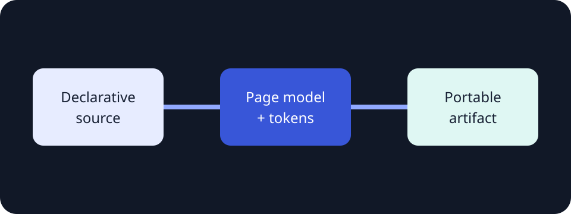

# Architecture decision record

**Fictional sample.** Every metric, status, organization, and decision on this page exists only to
demonstrate the report engine; replace it with verified project evidence before use.

A focused reading surface for a decision, its evidence, and the path from constraints to rollout.

:::callout{kind="info" title="Decision status"}
Accepted for the next implementation unit after local validation.
:::

## Context

The product turns declarative Markdown into a portable interactive browser page. Authors provide meaning;
the package owns layout, tokens, navigation, and focus behavior.



## Options

| Option                   | Portability | Author effort | Runtime |
| ------------------------ | ----------: | ------------: | ------- |
| Package-owned page model |        High |           Low | Bounded |
| Hand-built application   |    Variable |          High | Custom  |
| Hosted editor            | Low offline |        Medium | Remote  |

:::decision{title="Use one registry-owned page model"}
Keep layout and visual choices as validated values. Do not expose arbitrary CSS or component code.
:::

## Implementation contract

```yaml
layout: document
theme: system
tokens:
  font: serif
  width: narrow
```

:::steps{title="Adoption path"}

1. Select a layout and theme.
2. Add semantic content blocks.
3. Validate, inspect, and build the artifact.
   :::

## Verification

The page remains readable on a narrow viewport, the contents drawer is keyboard reachable, and wide tables
scroll inside the reading surface instead of breaking the page.
