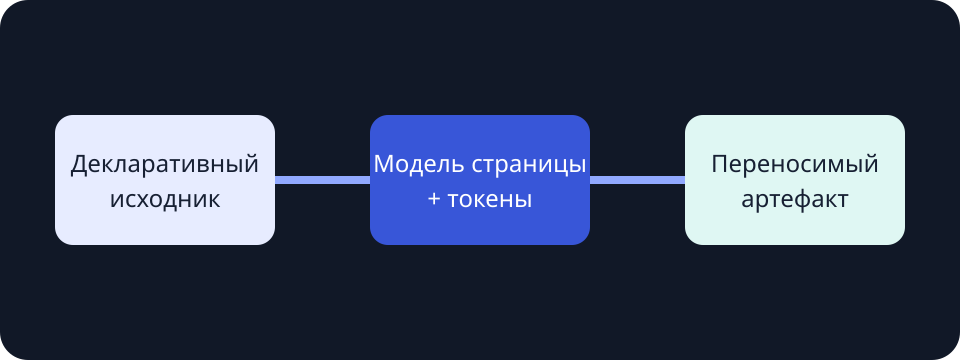

# Запись об архитектурном решении

**Вымышленный пример.** Все показатели, статусы, организации и решения на этой странице нужны только для
демонстрации движка отчётов; перед использованием замените их проверенными данными проекта.

Сосредоточенная поверхность для чтения решения, его доказательств и пути от ограничений к внедрению.

:::callout{kind="info" title="Статус решения"}
Принято для следующей единицы реализации после локальной проверки.
:::

## Контекст

Продукт превращает декларативный Markdown в переносимую интерактивную браузерную страницу. Автор задаёт
смысл, а пакет управляет компоновкой, токенами, навигацией и поведением фокуса.



## Варианты

| Вариант                   | Переносимость | Работа автора | Среда выполнения |
| ------------------------- | ------------: | ------------: | ---------------- |
| Модель страницы из пакета |       Высокая |        Низкая | Ограниченная     |
| Приложение ручной сборки  |     Различная |       Высокая | Специальная      |
| Облачный редактор         | Низкая офлайн |       Средняя | Удалённая        |

:::decision{title="Использовать единую модель страницы из реестра"}
Храните варианты компоновки и оформления как проверяемые значения. Не допускайте произвольный CSS или
код компонентов.
:::

## Контракт реализации

```yaml
layout: document
theme: system
tokens:
  font: serif
  width: narrow
```

:::steps{title="Путь внедрения"}

1. Выберите компоновку и тему.
2. Добавьте смысловые блоки содержимого.
3. Проверьте, проанализируйте и соберите артефакт.
   :::

## Проверка

Страница остаётся читаемой в узком окне, оглавление доступно с клавиатуры, а широкие таблицы прокручиваются
внутри области чтения и не ломают страницу.
