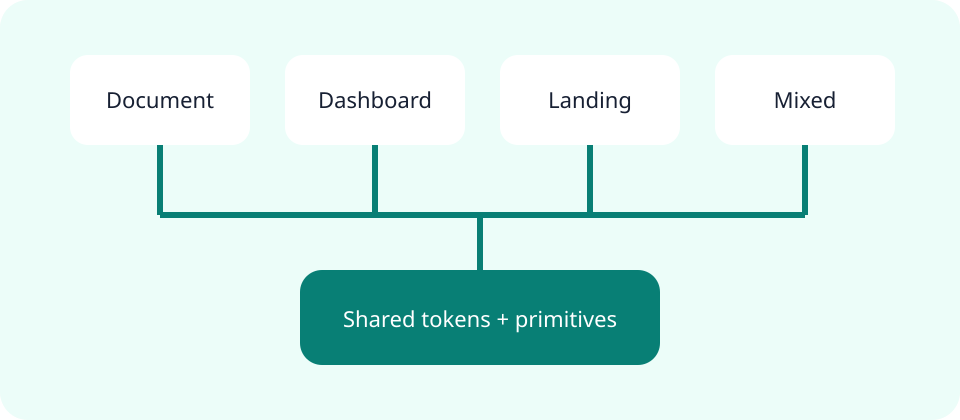

# Research synthesis

**Fictional sample.** Every metric, status, organization, and decision on this page exists only to
demonstrate the report engine; replace it with verified project evidence before use.

A mixed page keeps the main argument readable while allowing evidence-heavy sections to use the available
width.

:::callout{kind="info" title="Question"}
Can one declarative source support reports, operational summaries, and focused landing pages coherently?
:::

## Finding

The reusable unit is not a template generator. It is one validated page model rendered through a shared
token system and a small package-owned runtime.

## Evidence matrix

| Property            | Document  | Dashboard | Landing   | Mixed     |
| ------------------- | --------- | --------- | --------- | --------- |
| Long-form reading   | Primary   | Secondary | Focused   | Primary   |
| Dense cards         | Supported | Primary   | Supported | Supported |
| Persistent contents | Sidebar   | Top row   | Top row   | Sidebar   |
| Mobile drawer       | Yes       | Yes       | Yes       | Yes       |

::::cards
:::card{title="Consistent"}
Every primitive consumes the same color, spacing, typography, radius, and focus tokens.
:::
:::card{title="Responsive"}
Shells collapse to one column and wide content stays locally scrollable.
:::
:::card{title="Extensible"}
New package-owned capabilities project from the typed registry instead of branching the source format.
:::
::::

## Recommendation

:::decision{title="Keep one page system"}
Add future interaction and visualization primitives to this foundation rather than creating layout-specific
renderers.
:::
