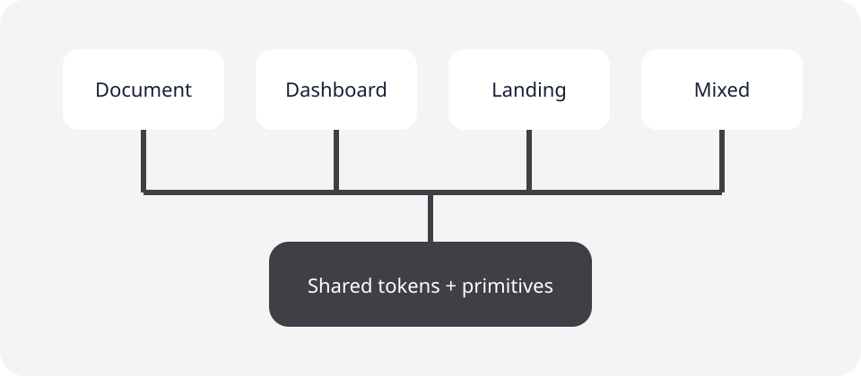

# Complete visual language catalog

**Fictional sample.** Every observation exists only to demonstrate the authoring system. Replace it with
verified evidence before use.

::::section{title="The whole system on one map" id="demo" nav="Map" recipe="demo"}

::::

:::::section{title="Evidence becomes a spatial argument" id="stage" nav="Stage" width="wide" composition="stage" viewport="full" section-density="immersive" type="display" media="mask" media-fit="cover" media-aspect="cinematic" focal="right" surface="tint" transition="stagger" scene="progress" choreography="cascade"}
:::lead
One semantic section combines display type, confined media, a bounded full viewport, and a package-owned
surface without author CSS or a custom page renderer.
:::

:::actions{placement="auto"}
::action[Explore the visual system]{href="#mosaic" kind="primary" effect="magnetic"}
:::
:::::

::::section{title="The source stays ordinary" id="split" nav="Source" composition="split" viewport="bounded" section-density="editorial" type="editorial" surface="grain"}
The left side carries the thesis while the authored flow on the right remains normal Markdown. Reading and
focus order do not follow visual placement.

:::callout{kind="info" title="Boundary"}
Layout, media, and surface values come from closed registries. Unknown values fail before HTML exists.
:::
::::

:::::section{title="A mosaic changes rhythm, not meaning" id="mosaic" nav="Mosaic" width="wide" composition="mosaic" section-density="compact" media="natural" media-fit="cover" media-aspect="landscape" focal="center" surface="grid" transition="stagger" choreography="cascade"}
::::cards
:::card{title="Primary proof"}

The first card receives more visual area while remaining the first semantic item.
:::
:::card{title="Portable"}
Single-file embeds the local image. Directory output hashes the same confined bytes.
:::
:::card{title="Composable"}
The same section vocabulary works in document, dashboard, landing, and mixed page shells.
:::
::::
:::::

::::section{title="Long evidence keeps its context" id="story" nav="Story" width="wide" composition="story" viewport="bounded" section-density="immersive" type="display" media="natural" media-fit="cover" media-aspect="landscape" focal="left" surface="tint"}

The media remains visible beside a longer desktop explanation without changing document order. On narrow
screens it returns to ordinary flow. This paragraph establishes the first part of the argument and keeps a
comfortable reading measure.

The second part compares constraints: local resources only, deterministic output, and a package-owned
presentation vocabulary. The image never becomes a background that can erase its accessible alternative.

The final part makes the boundary observable: responsive composition must change placement rather than hide
overflow, and tall screens must contain real evidence instead of empty viewport-sized plates.
::::

:::::section{title="A stack expresses priority" id="stack" nav="Stack" composition="stack" section-density="editorial" type="editorial" surface="plain"}
::::cards
:::card{title="Read first"}
The accepted recommendation remains at the top of the authored order.
:::
:::card{title="Then verify"}
Supporting evidence follows without being removed from keyboard or reading flow.
:::
:::card{title="Finally act"}
The last card closes the sequence with a concrete next step.
:::
::::
:::::

::::section{title="Media can meet the section edge" id="bleed" nav="Bleed" width="wide" composition="flow" viewport="bounded" section-density="immersive" type="display" media="bleed" media-fit="cover" media-aspect="cinematic" focal="center" surface="tint" interaction="depth"}
The source remains an ordinary confined Markdown image; the package lets it reach the visual surface edge
without accepting author CSS or a remote URL.

::::

:::::section{title="Several local views can form depth" id="layers" nav="Layers" width="wide" composition="split" viewport="bounded" section-density="editorial" type="editorial" media="layers" media-fit="cover" media-aspect="portrait" focal="center" surface="grain"}
::::cards
:::card

:::
:::card

:::
:::card

:::
::::
:::::

:::::section{title="A gallery carries several views" id="gallery" nav="Gallery" width="wide" composition="stage" viewport="adaptive" section-density="compact" type="body" media="gallery" media-fit="cover" media-aspect="landscape" focal="center" surface="plain"}
::::cards
:::card{title="System view"}

:::
:::card{title="Evidence view"}

:::
:::card{title="Decision view"}

:::
::::
:::::

::::section{title="A detail worth a closer look" id="spotlight" nav="Spotlight"}
:::spotlight{x="30" y="40" zoom="2" title="The shared foundation"}

Every layout stands on the same foundation: one source contract, one theme, one runtime.
:::
::::

::::section{title="One claim before the evidence" id="thesis" nav="Thesis" recipe="thesis"}
:::lead
A page earns attention with one sentence the reader can repeat, and only then with the proof.
:::

The thesis recipe sets that sentence in display type at reading width, with no picture competing for it.
::::

::::section{title="The same page before and after" id="compare" nav="Compare" width="wide"}
:::compare{before="Wireframe" after="Built page"}

:::

Drag the divider or move the slider with the arrow keys; both images keep their alternative text.
::::

::::section{title="Drawn like a specification" id="blueprint" nav="Blueprint" recipe="blueprint"}
The blueprint recipe puts a drafting grid behind a hairline panel and sets captions like drawing
annotations, so a system diagram reads as a specification rather than a decoration.

:::diagram{title="Source to page" description="Markdown becomes a checked page through three stages." layout="right"}
::node{id="source" label="Markdown"}
::node{id="check" label="Checks" kind="accent"}
::node{id="page" label="Page"}
::edge{from="source" to="check" label="parse"}
::edge{from="check" to="page" label="build" kind="data"}
::legend-item{node="accent" label="Validation step"}
:::
::::

::::section{title="What readers said" id="quote" nav="Quote" recipe="statement"}

> The first page I did not have to explain before sending it.

— Fictional reviewer, support team lead
::::

::::section{title="74%" id="figure" nav="Figure" recipe="statement"}
of fictional pilot readers found the answer with the first search.
::::

::::section{title="Motion follows the argument" id="motion" nav="Motion" scene="steps" transition="lines"}
:::diagram{title="Grammar to page" description="Roles become one page through the compiler and the reader runtime." layout="right" draw="scroll"}
::node{id="roles" label="Roles"}
::node{id="compiler" label="Compiler" kind="accent"}
::node{id="page" label="Page"}
::edge{from="roles" to="compiler" label="validate"}
::edge{from="compiler" to="page" label="render" kind="data"}
::legend-item{node="accent" label="Validation step"}
:::

:::beat{title="Declare" focus="roles, compiler"}
Authors name roles; the diagram draws its connections as it scrolls into view.
:::

:::beat{title="Render" focus="compiler, page"}
:count[44] directives compile to one page; each beat lights its part of the diagram.
:::
::::

::::section{title="An image that unweaves" id="threads" nav="Threads" media-effect="threads"}

With WebGL the map unweaves into threads as it leaves the screen; without it, and under reduced motion,
it stays whole.
::::

:::decision{title="Use one declarative visual language"}
Compose semantic roles instead of generating a bespoke application for each handoff.
:::

| Layer       | Declarative role    | Portable result      | Runtime owner   | Narrow-screen behavior    |
| ----------- | ------------------- | -------------------- | --------------- | ------------------------- |
| Composition | Spatial hierarchy   | Stable reading order | Package         | Returns to document flow  |
| Media       | Local art direction | Confined assets      | Compiler        | Preserves accessible text |
| Surface     | Visual atmosphere   | Package-owned CSS    | Browser runtime | Never obscures content    |
