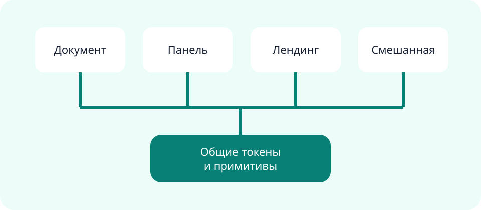

# Синтез исследования

**Вымышленный пример.** Все наблюдения нужны только для демонстрации авторской системы. Перед применением
замените их проверенными доказательствами.

:::::section{title="Доказательство становится пространственным аргументом" id="stage" nav="Сцена" width="wide" composition="stage" viewport="full" section-density="immersive" type="display" media="mask" media-fit="cover" media-aspect="cinematic" focal="right" surface="mesh" transition="stagger" scene="progress" choreography="cascade"}
:::lead
Один смысловой раздел соединяет крупную типографику, локальное медиа, ограниченный полный viewport и
поверхность из пакета — без авторского CSS и отдельного рендерера страницы.
:::

:::actions{placement="auto"}
::action[Изучить визуальную систему]{href="#mosaic" kind="primary" effect="magnetic"}
:::
:::::

::::section{title="Исходник остаётся обычным" id="split" nav="Исходник" composition="split" viewport="bounded" section-density="editorial" type="editorial" surface="grain"}
Слева находится тезис, а авторский поток справа остаётся обычным Markdown. Порядок чтения и фокуса не
зависит от визуального расположения.

:::callout{kind="info" title="Граница"}
Значения компоновки, медиа и поверхности берутся из закрытых реестров. Неизвестное значение отклоняется до
создания HTML.
:::
::::

:::::section{title="Мозаика меняет ритм, а не смысл" id="mosaic" nav="Мозаика" width="wide" composition="mosaic" section-density="compact" media="natural" media-fit="cover" media-aspect="landscape" focal="center" surface="grid" transition="stagger" choreography="cascade"}
::::cards
:::card{title="Главное доказательство"}

Первая карточка получает больше визуального пространства, оставаясь первым смысловым элементом.
:::
:::card{title="Переносимость"}
Single-file встраивает локальное изображение. Directory хеширует те же ограниченные корнем байты.
:::
:::card{title="Композиция"}
Один словарь разделов работает в оболочках document, dashboard, landing и mixed.
:::
::::
:::::

::::section{title="Длинное доказательство сохраняет контекст" id="story" nav="История" width="wide" composition="story" viewport="bounded" section-density="immersive" type="display" media="natural" media-fit="cover" media-aspect="landscape" focal="left" surface="glow"}

На широком экране медиа остаётся рядом с длинным объяснением, не меняя порядок документа. На узком экране
оно возвращается в обычный поток. Этот абзац начинает аргумент и сохраняет удобную длину строки.

Вторая часть сопоставляет ограничения: только локальные ресурсы, детерминированный результат и визуальный
словарь из пакета. Изображение не превращается в фон, способный стереть его доступное описание.

Последняя часть делает границу наблюдаемой: адаптивная композиция меняет расположение, а не скрывает
переполнение; высокий экран содержит доказательства, а не пустые пластины высотой во viewport.
::::

:::::section{title="Стопка выражает приоритет" id="stack" nav="Стопка" composition="stack" section-density="editorial" type="editorial" surface="plain"}
::::cards
:::card{title="Сначала прочитать"}
Принятая рекомендация остаётся первой в авторском порядке.
:::
:::card{title="Затем проверить"}
Подтверждения следуют дальше и не исчезают из клавиатурного маршрута или чтения.
:::
:::card{title="После — действовать"}
Последняя карточка завершает последовательность конкретным следующим шагом.
:::
::::
:::::

::::section{title="Медиа может доходить до края раздела" id="bleed" nav="В край" width="wide" composition="flow" viewport="bounded" section-density="immersive" type="display" media="bleed" media-fit="cover" media-aspect="cinematic" focal="center" surface="mesh" interaction="depth"}
Исходник остаётся обычным локальным изображением Markdown; пакет доводит его до края визуальной поверхности,
не принимая авторский CSS или удалённый URL.

::::

:::::section{title="Несколько локальных видов создают глубину" id="layers" nav="Слои" width="wide" composition="split" viewport="bounded" section-density="editorial" type="editorial" media="layers" media-fit="cover" media-aspect="portrait" focal="center" surface="grain"}
::::cards
:::card

:::
:::card

:::
:::card

:::
::::
:::::

:::::section{title="Галерея показывает несколько видов" id="gallery" nav="Галерея" width="wide" composition="stage" viewport="adaptive" section-density="compact" type="body" media="gallery" media-fit="cover" media-aspect="landscape" focal="center" surface="plain"}
::::cards
:::card{title="Система"}

:::
:::card{title="Доказательства"}

:::
:::card{title="Решение"}

:::
::::
:::::

:::decision{title="Использовать единый декларативный визуальный язык"}
Собирайте смысловые роли вместо отдельного приложения для каждой передачи результата.
:::

| Слой        | Декларативная роль        | Переносимый результат       | Владелец выполнения | Поведение на узком экране      |
| ----------- | ------------------------- | --------------------------- | ------------------- | ------------------------------ |
| Композиция  | Пространственная иерархия | Стабильный порядок чтения   | Пакет               | Возвращается в поток документа |
| Медиа       | Локальная арт-дирекция    | Ограниченные корнем ресурсы | Компилятор          | Сохраняет доступный текст      |
| Поверхность | Визуальная атмосфера      | CSS из пакета               | Браузерный runtime  | Не перекрывает содержимое      |
