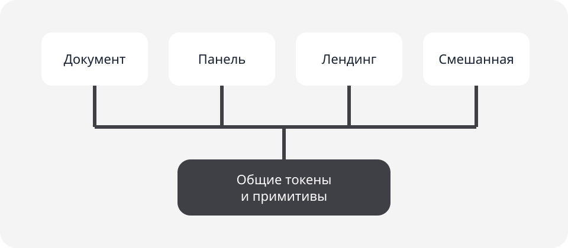
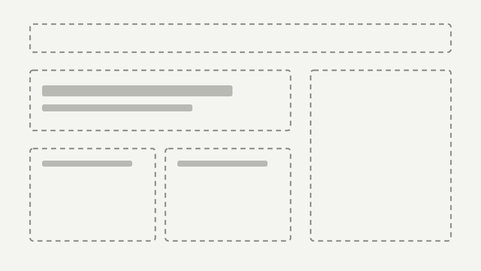
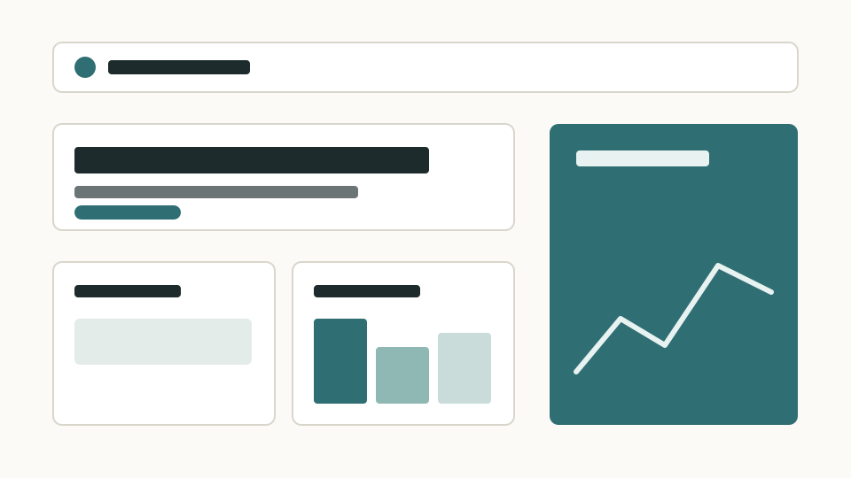

# Полный каталог визуального языка

**Вымышленный пример.** Все наблюдения нужны только для демонстрации авторской системы. Перед применением
замените их проверенными доказательствами.

::::section{title="Вся система на одной карте" id="demo" nav="Карта" recipe="demo"}

::::

:::::section{title="Доказательство становится пространственным аргументом" id="stage" nav="Сцена" width="wide" composition="stage" viewport="full" section-density="immersive" type="display" media="mask" media-fit="cover" media-aspect="cinematic" focal="right" surface="tint" transition="stagger" scene="progress" choreography="cascade"}
:::lead
Один смысловой раздел соединяет крупную типографику, локальное медиа, ограниченную область просмотра и
поверхность из пакета — без авторского CSS и отдельного рендерера страницы.
:::

:::actions{placement="auto"}
::action[Изучить визуальную систему]{href="#mosaic" kind="primary" effect="magnetic"}
:::
:::::

::::section{title="Исходник остаётся обычным" id="split" nav="Исходник" composition="split" viewport="bounded" section-density="editorial" type="editorial" surface="grain"}
Слева находится тезис, а авторский поток справа остаётся обычным Markdown. Порядок чтения и фокуса не
зависит от визуального расположения.

:::callout{kind="info" title="Граница"}
Значения компоновки, медиа и поверхности берутся из закрытых реестров. Неизвестное значение отклоняется до
создания HTML.
:::
::::

:::::section{title="Мозаика меняет ритм, а не смысл" id="mosaic" nav="Мозаика" width="wide" composition="mosaic" section-density="compact" media="natural" media-fit="cover" media-aspect="landscape" focal="center" surface="grid" transition="stagger" choreography="cascade"}
::::cards
:::card{title="Главное доказательство"}

Первая карточка получает больше визуального пространства, оставаясь первым смысловым элементом.
:::
:::card{title="Переносимость"}
Формат single-file встраивает локальное изображение. Формат directory сохраняет те же байты отдельным файлом
с именем по хешу содержимого.
:::
:::card{title="Композиция"}
Один словарь разделов работает в оболочках document, dashboard, landing и mixed.
:::
::::
:::::

::::section{title="Длинное доказательство сохраняет контекст" id="story" nav="История" width="wide" composition="story" viewport="bounded" section-density="immersive" type="display" media="natural" media-fit="cover" media-aspect="landscape" focal="left" surface="tint"}

На широком экране медиа остаётся рядом с длинным объяснением, не меняя порядок документа. На узком экране
оно возвращается в обычный поток. Этот абзац начинает аргумент и сохраняет удобную длину строки.

Вторая часть сопоставляет ограничения: только локальные ресурсы, детерминированный результат и визуальный
словарь из пакета. Изображение не превращается в фон, способный стереть его доступное описание.

Последняя часть делает границу наблюдаемой: адаптивная композиция меняет расположение, а не скрывает
переполнение; высокий экран содержит доказательства, а не пустые пластины высотой во всю область просмотра.
::::

:::::section{title="Стопка выражает приоритет" id="stack" nav="Стопка" composition="stack" section-density="editorial" type="editorial" surface="plain"}
::::cards
:::card{title="Сначала прочитать"}
Принятая рекомендация остаётся первой в авторском порядке.
:::
:::card{title="Затем проверить"}
Подтверждения следуют дальше и не исчезают из клавиатурного маршрута или чтения.
:::
:::card{title="После — действовать"}
Последняя карточка завершает последовательность конкретным следующим шагом.
:::
::::
:::::

::::section{title="Медиа может доходить до края раздела" id="bleed" nav="В край" width="wide" composition="flow" viewport="bounded" section-density="immersive" type="display" media="bleed" media-fit="cover" media-aspect="cinematic" focal="center" surface="tint" interaction="depth"}
Исходник остаётся обычным локальным изображением Markdown; пакет доводит его до края визуальной поверхности,
не принимая авторский CSS или удалённый URL.

::::

:::::section{title="Несколько локальных видов создают глубину" id="layers" nav="Слои" width="wide" composition="split" viewport="bounded" section-density="editorial" type="editorial" media="layers" media-fit="cover" media-aspect="portrait" focal="center" surface="grain"}
::::cards
:::card

:::
:::card

:::
:::card

:::
::::
:::::

:::::section{title="Галерея показывает несколько видов" id="gallery" nav="Галерея" width="wide" composition="stage" viewport="adaptive" section-density="compact" type="body" media="gallery" media-fit="cover" media-aspect="landscape" focal="center" surface="plain"}
::::cards
:::card{title="Система"}

:::
:::card{title="Доказательства"}

:::
:::card{title="Решение"}

:::
::::
:::::

::::section{title="Деталь, на которую стоит посмотреть ближе" id="spotlight" nav="Деталь"}
:::spotlight{x="30" y="40" zoom="2" title="Общее основание"}

Все раскладки построены на общей основе: единый формат исходника, тема и среда выполнения.
:::
::::

::::section{title="Одно утверждение до доказательств" id="thesis" nav="Тезис" recipe="thesis"}
:::lead
Страница завоёвывает внимание одной фразой, которую читатель может повторить, и только потом — доказательствами.
:::

Рецепт тезиса ставит эту фразу крупным набором в ширину чтения, и никакая картинка с ней не спорит.
::::

::::section{title="Одна страница до и после" id="compare" nav="Сравнение" width="wide"}
:::compare{before="Эскиз" after="Готовая страница"}

:::

Перетащите границу или двигайте ползунок стрелками; у обеих картинок остаётся текстовое описание.
::::

::::section{title="Нарисовано как спецификация" id="blueprint" nav="Чертёж" recipe="blueprint"}
Рецепт чертежа кладёт под панель чертёжную сетку и набирает подписи как выноски, поэтому схема системы
читается как спецификация, а не как украшение.

:::diagram{title="От исходника к странице" description="Markdown становится проверенной страницей за три шага." layout="right"}
::node{id="source" label="Markdown"}
::node{id="check" label="Проверки" kind="accent"}
::node{id="page" label="Страница"}
::edge{from="source" to="check" label="разбор"}
::edge{from="check" to="page" label="сборка" kind="data"}
::legend-item{node="accent" label="Шаг проверки"}
:::
::::

::::section{title="Что сказали читатели" id="quote" nav="Цитата" recipe="statement"}

> Первая страница, которую не пришлось объяснять перед отправкой.

— Вымышленный рецензент, руководитель поддержки
::::

::::section{title="74%" id="figure" nav="Цифра" recipe="statement"}
вымышленных читателей пилота нашли ответ с первого поиска.
::::

::::section{title="Движение следует за доводом" id="motion" nav="Движение" scene="steps" transition="lines"}
:::diagram{title="От грамматики к странице" description="Роли превращаются в страницу благодаря компилятору и браузерной части пакета." layout="right" draw="scroll"}
::node{id="roles" label="Роли"}
::node{id="compiler" label="Компилятор" kind="accent"}
::node{id="page" label="Страница"}
::edge{from="roles" to="compiler" label="проверка"}
::edge{from="compiler" to="page" label="сборка" kind="data"}
::legend-item{node="accent" label="Шаг проверки"}
:::

:::beat{title="Объявить" focus="roles, compiler"}
Автор называет роли; связи схемы прорисовываются, пока она прокручивается на экран.
:::

:::beat{title="Собрать" focus="compiler, page"}
:count[44] директивы собираются в одну страницу; каждый такт подсвечивает свою часть схемы.
:::
::::

::::section{title="Иллюстрация остаётся в потоке чтения" id="still-image" nav="Иллюстрация"}

Завершающая схема сохраняет описание и место в порядке чтения при любой ширине экрана и настройке движения.
::::

:::decision{title="Использовать единый декларативный визуальный язык"}
Собирайте смысловые роли вместо отдельного приложения для каждой передачи результата.
:::

| Слой        | Декларативная роль        | Переносимый результат       | Владелец выполнения | Поведение на узком экране      |
| ----------- | ------------------------- | --------------------------- | ------------------- | ------------------------------ |
| Композиция  | Пространственная иерархия | Стабильный порядок чтения   | Пакет               | Возвращается в поток документа |
| Медиа       | Локальная арт-дирекция    | Ограниченные корнем ресурсы | Компилятор          | Сохраняет доступный текст      |
| Поверхность | Визуальная атмосфера      | CSS из пакета               | Среда в браузере    | Не перекрывает содержимое      |
