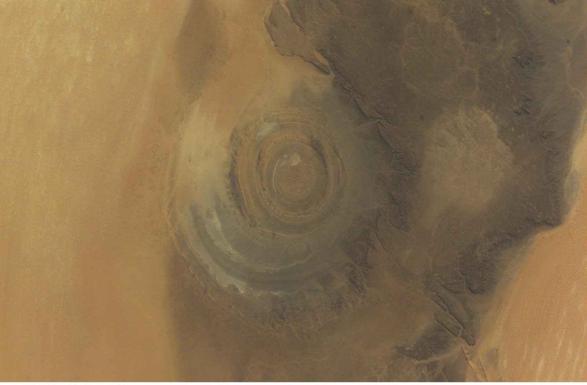
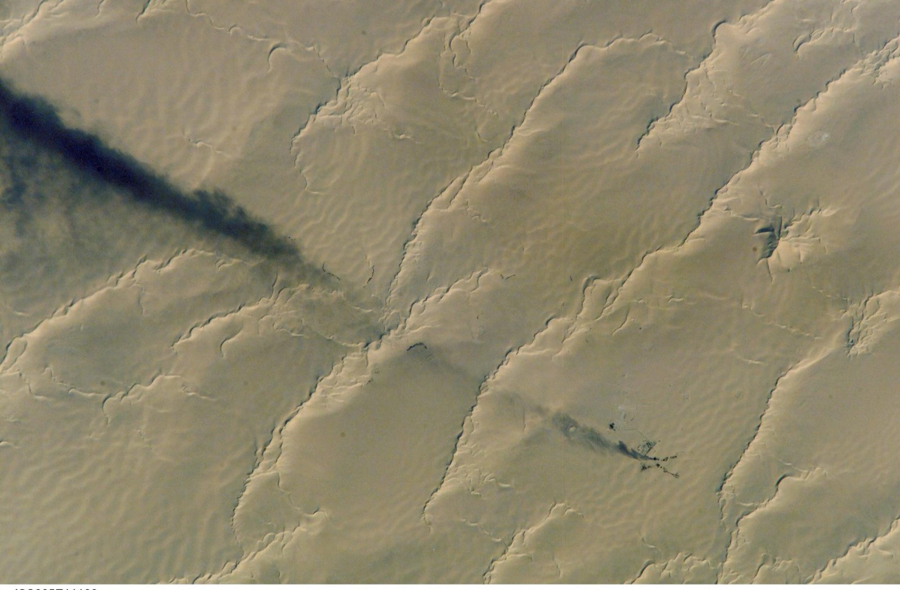
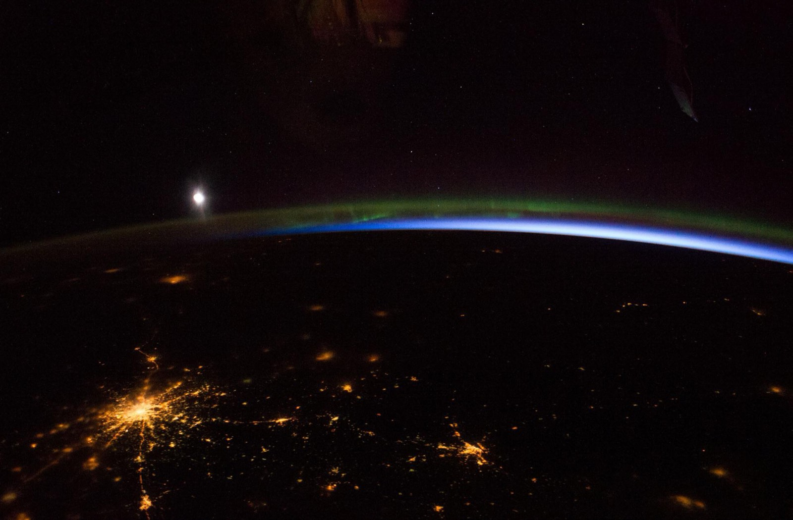

# Motion that carries the story

**Fictional sample.** Every place, metric, status, and conclusion on this page exists only to demonstrate
the report engine; replace it with verified project evidence before use.

::::actions{placement="inline"}
::action[Enter the first scene]{href="#opening" kind="primary" effect="magnetic"}
::action[Browse the image rail]{href="#rail" kind="secondary"}
::action[Check reduced motion]{href="#fallback" kind="quiet"}
::::

:::::section{title="Depth follows attention" id="opening" nav="Depth" recipe="hero" scene="none" interaction="depth"}
:::lead
Scroll changes the relationship between image and frame. Fine-pointer depth adds response without becoming
the only way to read or navigate the page.
:::

:::callout{kind="info" title="Move, scroll, or simply read"}
The package owns the effect, its bounds, and the fallback. Authored content remains ordinary Markdown.
:::
:::::

:::::section{title="A rail can feel continuous without leaving its container" id="rail" nav="Rail" recipe="rail" scene="progress"}
::::cards
:::card{title="Mineral light"}

:::
:::card{title="Night terrain"}

:::
:::card{title="Distant signal"}

:::
::::
:::::

:::::section{title="Sequence makes evidence easier to scan" id="sequence" nav="Sequence" recipe="metrics"}
::::cards
:::card{title="Reveal"}
Sections enter only when they become relevant.
:::
:::card{title="Stagger"}
Related items arrive in authored order.
:::
:::card{title="Progress"}
Scene depth follows bounded scroll progress.
:::
:::card{title="Pointer"}
Fine-pointer response is local and frame-coalesced.
:::
::::
:::::

:::::section{title="One picture, three moments" id="steps" nav="Steps" scene="steps"}

::::beat{title="Night falls"}
The scene stays pinned while this text scrolls; each beat brings its own picture.
::::

::::beat{title="The city lights up"}
On a narrow screen or with reduced motion the pictures and beats simply follow each other.
::::

::::beat{title="Light returns"}
Nothing here is animated per letter: the picture changes when the next beat reaches the middle of the screen.
::::
:::::

:::::section{title="A flow drawn as you read it" id="draw" nav="Drawing" scene="steps" transition="lines"}
:::diagram{title="Signal path" description="A signal moves from sensor to archive, with a correction fed back." layout="right" draw="scroll"}
::node{id="sensor" label="Sensor"}
::node{id="filter" label="Filter" kind="accent"}
::node{id="model" label="Model"}
::node{id="archive" label="Archive" kind="success"}
::edge{from="sensor" to="filter" label="raw"}
::edge{from="filter" to="model" label="clean" kind="data"}
::edge{from="model" to="archive" label="store"}
::edge{from="model" to="filter" label="tune" kind="event"}
::legend-item{node="accent" label="Receives corrections"}
::legend-item{node="success" label="Final destination"}
:::

::::beat{title="Capture" focus="sensor, filter"}
The connections draw themselves in the order of the flow as the diagram passes through the view.
::::

::::beat{title="Interpret" focus="filter, model"}
Each beat lights the part of the diagram it talks about.
::::

::::beat{title="Keep" focus="model, archive"}
The correction back to the filter is drawn last, as its own phase.
::::
:::::

:::::section{title="Numbers that arrive" id="numbers" nav="Numbers" recipe="statement" media-effect="threads"}

:count[1,284] field frames were read, and :count[97.5%] of them kept their horizon.

The picture unweaves into threads as it leaves the screen; without WebGL it stays still.
:::::

:::::section{title="The effect never owns the meaning" id="fallback" nav="Fallback" recipe="evidence" interaction="tilt"}

:::decision{title="Keep content complete without motion"}
When reduced motion is enabled, every image, card, control, and conclusion remains visible in the same
reading order. Only movement disappears.
:::

:::popover{title="What is package-owned?" trigger="Inspect the boundary"}
Timing, distance, pointer gating, viewport observation, and reduced-motion behavior live in the runtime.
The source declares only a closed semantic role.
:::

::::actions{placement="bottom"}
::action[Return to depth]{href="#opening" kind="primary" effect="magnetic"}
::action[Open the Cinematic story]{href="../cinematic-story/index.html" kind="secondary"}
::::
:::::
