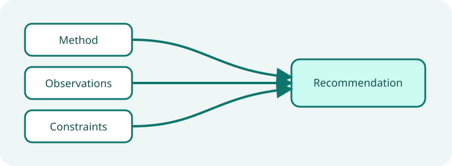

# Assisted authoring research synthesis

**Fictional sample.** Every metric, status, organization, and decision on this page exists only to
demonstrate the report engine; replace it with verified project evidence before use.

This starter turns a research question into a transparent recommendation. It keeps the method and evidence
close enough for another agent to challenge the conclusion.

::::::section{title="Research frame" id="frame" nav="Frame" width="wide" tone="contrast" composition="stage" viewport="bounded" section-density="compact" type="display" surface="mesh" transition="stagger" choreography="cascade"}
:::callout{kind="info" title="Research question"}
Which authoring route gives agents the shortest path to a portable, reviewable interactive page?
:::

{{include: partials/method.md}}
::::::

::::::section{title="Evidence model" id="evidence" nav="Evidence" width="wide" tone="soft" composition="story" viewport="bounded" section-density="editorial" type="editorial" media="mask" media-fit="contain" media-aspect="landscape" surface="grain" transition="reveal" interaction="depth"}

::::tabs{title="Evidence views"}
:::tab{label="Observed"}
Agents completed the declarative path without writing browser code or starting a server.
:::
:::tab{label="Constraints"}
The output had to remain offline, deterministic, accessible, and openable through `file://`.
:::
:::tab{label="Unknowns"}
Long-term adoption and maintenance cost require longitudinal evidence beyond this focused study.
:::
::::
::::::

::::::section{title="Comparison" id="comparison" nav="Comparison" width="wide" tone="plain" composition="split" viewport="bounded" section-density="editorial" type="display" surface="grid" transition="stagger" scene="progress" choreography="cascade"}

:::::chart{type="bar" title="First useful artifact" description="Median focused work units required to reach a reviewable local artifact; lower is better." x-label="Authoring route" y-label="Work units"}
::::series{label="Median effort"}
::point{label="Declarative starter" value="3"}
::point{label="Blank Markdown" value="6"}
::point{label="Custom frontend" value="14"}
::::
:::::
::::::

::::::section{title="Interpretation and follow-up" id="interpretation" nav="Decision" width="wide" tone="accent" composition="stack" viewport="adaptive" section-density="compact" type="editorial" surface="glow" transition="reveal"}

:::disclosure{title="Read the validity limits" open="true"}
The comparison measures a bounded local task, not every publishing workflow. It supports the recommendation
only for portable static pages within the stated security boundary.
:::

:::decision{title="Prefer the declarative starter path"}
Use a starter when the intended page fits the package vocabulary. Escalate to a custom application only
when verified requirements exceed that vocabulary.
:::

:::steps{title="Extend the study"}

1. Replace the sample observation table with traceable session evidence.
2. Record exclusions and counterexamples before updating the recommendation.
3. Re-run the comparison after a meaningful authoring-contract change.
   :::
   ::::::
