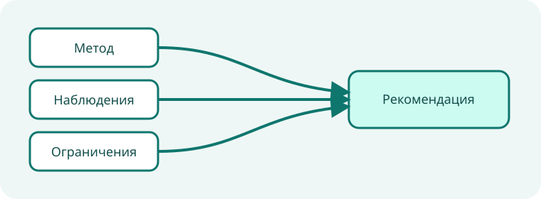

# Исследовательский синтез с поддержкой автора

**Вымышленный пример.** Все метрики, статусы, организации и решения на этой странице нужны только для
демонстрации движка отчётов; перед использованием замените их проверенными данными проекта.

Эта основа превращает исследовательский вопрос в прозрачную рекомендацию. Метод и доказательства находятся
достаточно близко, чтобы другой агент мог оспорить вывод.

::::::section{title="Рамка исследования" id="frame" nav="Вопрос" recipe="hero"}
:::callout{kind="info" title="Исследовательский вопрос"}
Какой авторский путь быстрее всего приводит агента к переносимой интерактивной странице, пригодной для ревью?
:::

{{include: partials/method.ru.md}}
::::::

::::::section{title="Модель доказательств" id="evidence" nav="Данные" recipe="evidence"}

::::tabs{title="Представления доказательств"}
:::tab{label="Наблюдения"}
Агенты завершили декларативный путь, не написав браузерный код и не запустив сервер.
:::
:::tab{label="Ограничения"}
Результат должен оставаться автономным, детерминированным, доступным и открываться через `file://`.
:::
:::tab{label="Неизвестное"}
Для оценки долгосрочного внедрения и стоимости поддержки нужны наблюдения за пределами этого исследования.
:::
::::
::::::

::::::section{title="Сравнение" id="comparison" nav="Сравнение" recipe="metrics"}

:::::chart{type="bar" title="Первый полезный артефакт" description="Медианное число целевых рабочих единиц до локального артефакта для ревью; меньше — лучше." x-label="Авторский путь" y-label="Рабочие единицы"}
::::series{label="Медианные усилия"}
::point{label="Декларативная основа" value="3"}
::point{label="Пустой Markdown" value="6"}
::point{label="Собственный frontend" value="14"}
::::
:::::
::::::

::::::section{title="Интерпретация и продолжение" id="interpretation" nav="Решение" recipe="story"}

:::disclosure{title="Прочитать ограничения достоверности" open="true"}
Сравнение измеряет ограниченную локальную задачу, а не каждый процесс публикации. Оно поддерживает
рекомендацию только для переносимых статических страниц в заявленной границе безопасности.
:::

:::decision{title="Предпочесть декларативную основу"}
Используйте starter, когда страница укладывается в словарь пакета. Переходите к отдельному приложению,
только когда проверенные требования выходят за этот словарь.
:::

:::steps{title="Расширить исследование"}

1. Заменить таблицу наблюдений отслеживаемыми данными сессий.
2. Зафиксировать исключения и контрпримеры до изменения рекомендации.
3. Повторить сравнение после значимого изменения авторского контракта.
   :::
   ::::::
