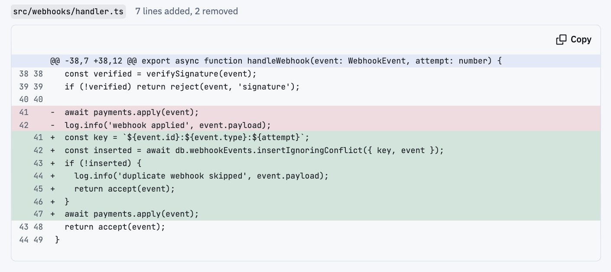

# Результат важнее церемоний

**Вымышленный пример.** Имена, даты, системы и результаты показывают возможности страницы. Перед
публикацией замените их проверенными фактами проекта.

`$ agentic-report build ./field-notes --output ./handoff.html`

::::actions{placement="edge"}
::action[Изучить работу]{href="#work" kind="primary" effect="magnetic"}
::action[Прочитать журнал]{href="#log" kind="secondary"}
::action[Открыть материалы для передачи]{href="#handoff" kind="quiet"}
::::

::::::section{title="Профиль инженера" id="profile" place="opening" nav="Профиль" recipe="hero"}
:::lead
Я превращаю неясные инфраструктурные задачи в небольшие наблюдаемые изменения. В каждой записи есть
команда, граница и результат, который рецензент сможет воспроизвести.
:::

{dark="assets/review-diff-dark.jpg"}

_Страница ревью, которую я передаю: снимок диффа из примера `code-review` agentic-report после сборки и открытия с диска._
::::::

::::::section{title="Избранные работы" id="work" nav="Работы" recipe="rail"}
::::cards
:::card{title="Исправление блокировки" href="#log"}
**Исходная задача:** воспроизводимая взаимная блокировка при ограниченной параллельности.

**Результат:** одно правило владения, детерминированная остановка и наблюдаемый путь восстановления.
:::
:::card{title="Граница выпуска" href="#handoff"}
**Исходная задача:** реализация и внешняя поставка смешаны в одном процессе.

**Результат:** проверенный локальный кандидат и отдельный этап выпуска с явным разрешением.
:::
:::card{title="Ограничение источника" href="#handoff"}
**Исходная задача:** локальные ресурсы из недоверенного декларативного источника.

**Результат:** канонические пути проверяются внутри корня источника до каждого чтения.
:::
::::
::::::

::::::section{title="Рабочий журнал" id="log" nav="Журнал" recipe="story"}
::::timeline{title="Одно изменение — четыре сигнала" description="Короткий журнал сохраняет порядок причины, действия, доказательства и ответственности."}
:::event{date="09:10" title="Воспроизведение" kind="neutral"}
Зафиксировано минимальное состояние, которое отличает сбой от исправного воркера.
:::
:::event{date="09:42" title="Исправление" kind="accent"}
Владение отменой перенесено на границу очереди, без добавления цикла повторных попыток.
:::
:::event{date="10:18" title="Проверка" kind="success"}
Через публичный интерфейс проверены обычное завершение, отмена и остановка процесса.
:::
:::event{date="10:31" title="Передача" kind="warning"}
Оставшееся внешнее действие выпуска записано без ложного утверждения о его выполнении.
:::
::legend-item{event="accent" label="Изменение кода"}
::legend-item{event="success" label="Проверено"}
::legend-item{event="warning" label="Ожидает действия"}
::::
::::::

::::::section{title="Передача проверяемого результата" id="handoff" nav="Передача" recipe="metrics"}

```sh
pnpm test:unit
pnpm test:e2e
agentic-report build ./field-notes --output ./handoff.html
```

:::decision{title="Интерфейс должен быть проще реализации"}
Читатель получает результат, доказательства и следующее действие. Композиция принадлежит пакету, поэтому
исходник остаётся обычным Markdown.
:::
::::::
