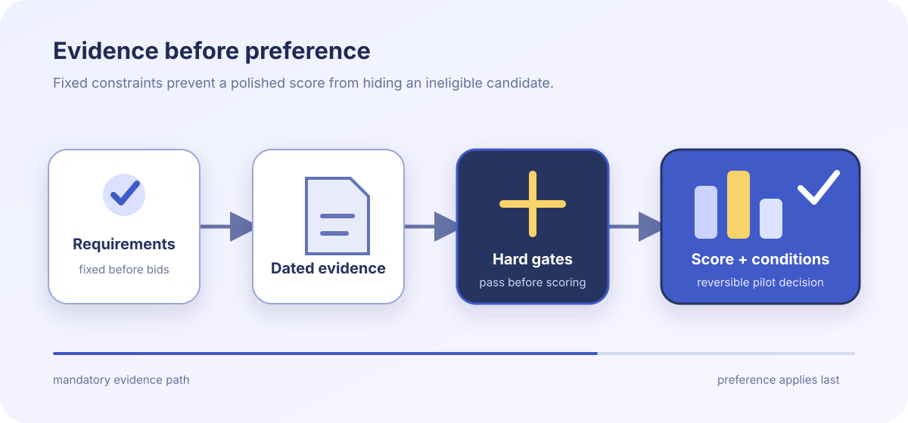

# AI support vendor decision packet

**Fictional showcase · 06 August 2026 · decision ready**

This demonstration follows a fictional procurement review for Lantern & Field, an invented customer
operations company. Every vendor, score, control, price, and evidence record is sample data created for the
report engine; none describes a real organization or commercial claim.

:::callout{kind="info" title="Decision in one minute"}
Select **Cedar Assist** for a 90-day reversible pilot. Meridian Reply has the highest weighted score, but it
fails a non-negotiable regional-processing gate. Quill Support passes every gate but trails Cedar on
workflow fit and implementation evidence.
:::

::::cards
:::card{title="Recommended"}
**Cedar Assist · 84/100**

Passes all four mandatory constraints with two time-bound conditions.
:::
:::card{title="Highest raw score"}
**Meridian Reply · 89/100**

Disqualified until its support telemetry remains inside the approved region.
:::
:::card{title="Qualified alternative"}
**Quill Support · 77/100**

Meets the baseline but needs more workflow and migration evidence.
:::
::::

The review treats a :term[hard gate]{key="hard-gate"} as a pass/fail constraint, never as a weighted
preference. An :term[evidence expiry]{key="evidence-expiry"} prevents an old assurance from remaining valid
indefinitely.

:::glossary{key="hard-gate" term="Hard gate"}
A mandatory security, legal, or portability condition. One failed gate disqualifies a candidate regardless
of its weighted score.
:::

:::glossary{key="evidence-expiry" term="Evidence expiry"}
The date after which a control claim must be re-tested or replaced before it can support the decision.
:::

## Gate decision

{{include: partials/gates.md}}

:::popover{title="Ranking exception" trigger="Why not the top score?"}
Meridian's 89-point result measures preferences only. Its failed regional-processing gate is
non-compensating, so additional usability or price points cannot make the candidate eligible.
:::

## Weighted comparison

:::::chart{type="bar" title="Weighted score after evidence review" description="Sample weighted scores rank Meridian Reply first at 89, Cedar Assist second at 84, and Quill Support third at 77; Meridian remains ineligible because it fails a separate mandatory constraint." x-label="Fictional candidate" y-label="Weighted score out of 100"}
::::series{label="Weighted score"}
::point{label="Cedar Assist" value="84"}
::point{label="Meridian Reply" value="89"}
::point{label="Quill Support" value="77"}
::::
:::::

| Weighted criterion    |  Weight | Cedar Assist | Meridian Reply | Quill Support |
| --------------------- | ------: | -----------: | -------------: | ------------: |
| Agent workflow fit    |      30 |           27 |             29 |            21 |
| Evidence quality      |      25 |           22 |             20 |            19 |
| Implementation effort |      20 |           16 |             17 |            15 |
| Portability depth     |      15 |           12 |             13 |            14 |
| Three-year cost       |      10 |            7 |             10 |             8 |
| **Total**             | **100** |       **84** |         **89** |        **77** |

::::tabs{title="Review lenses"}
:::tab{label="Scoring method"}
Weights were fixed before proposals were opened. Reviewers scored traceable evidence on a five-point rubric,
then normalized the result to 100. Hard-gate outcomes were not converted into points.
:::
:::tab{label="Evidence quality"}
Cedar supplied current audit extracts and a tested export. Meridian supplied strong workflow evidence but
an unresolved regional data-flow statement. Quill supplied complete policies but only a tabletop export.
:::
:::tab{label="Residual risks"}
Cedar must prove deletion propagation and peak-volume response quality during the pilot. The buyer retains
weekly export snapshots and a termination rehearsal as portability safeguards.
:::
::::

:::disclosure{title="Read the scoring assumptions and limits" open="false"}
Scores are fictional ordinal judgments, not measurements of real products. A two-point difference is not
treated as statistically meaningful. The recommendation depends on the stated four gates, pilot scope, and
evidence dates; changing any of them requires a new decision record.
:::

:::modal{title="Reviewer evidence checklist" trigger="Open the evidence checklist"}

- Confirm each gate cites a current owner and evidence date.
- Recalculate the weighted total without changing pre-declared weights.
- Verify the selected vendor has a tested export and deletion route.
- Record every pilot condition with an owner, deadline, and exit consequence.
  :::

## Decision and conditions

:::decision{title="Approve Cedar Assist for a reversible pilot"}
Proceed only for the EU support queue and exclude payment data. Security owns deletion verification by
21 August; Customer Operations owns peak-volume acceptance by 28 August. If either condition fails, stop
ingestion and execute the tested export within one business day. Meridian and Quill remain alternatives,
not fallback approvals.
:::

::::timeline{title="Governed adoption path" description="Four sample checkpoints keep evidence, pilot access, acceptance, and the final rollout decision separate."}
:::event{date="08 Aug" title="Evidence locked" kind="accent"}
Freeze the reviewed documents, hashes, owners, and expiry dates.
:::
:::event{date="12 Aug" title="Restricted pilot starts" kind="warning"}
Enable the EU queue with payment data excluded and weekly exports enabled.
:::
:::event{date="28 Aug" title="Conditions reviewed" kind="accent"}
Evaluate deletion propagation and peak-volume response against the written thresholds.
:::
:::event{date="04 Sep" title="Go or exit" kind="success"}
Approve wider use only if every gate remains passing and both pilot conditions close with evidence.
:::
::::

:::steps{title="Close the procurement decision"}

1. Attach dated evidence to each gate and record its expiry.
2. Sign the restricted data-processing schedule and pilot access list.
3. Run deletion and export rehearsals before adding a second queue.
4. Reopen the decision if a gate, material subprocessor, or data flow changes.
   :::
