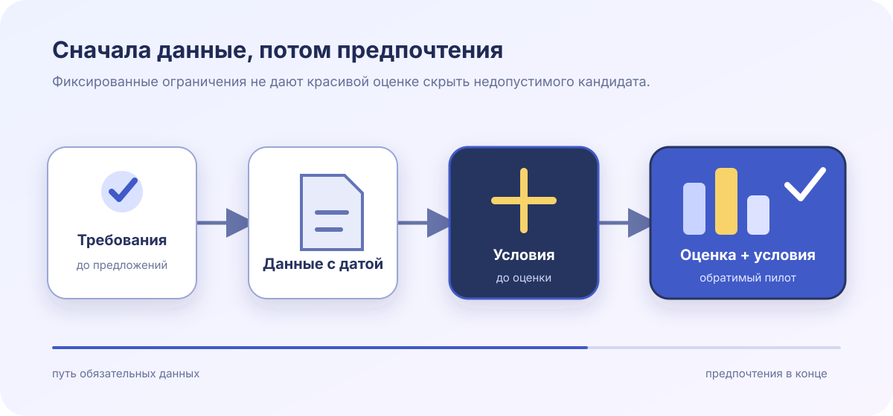

# Пакет решения по поставщику ИИ-поддержки

**Вымышленный пример · 6 августа 2026 года · решение готово**

Демонстрация описывает вымышленную закупку для придуманной компании клиентских операций Lantern & Field.
Все поставщики, оценки, средства контроля, цены и записи доказательств созданы для движка отчётов; они не
описывают реальную организацию или коммерческое утверждение.

:::::section{title="Сигнал решения" id="decision-signal" nav="Решение" width="wide" align="start" tone="contrast" composition="stage" viewport="full" section-density="immersive" type="display" surface="mesh" transition="stagger" choreography="cascade"}
:::callout{kind="info" title="Решение за минуту"}
Выберите **Cedar Assist** для обратимого 90-дневного пилота. Meridian Reply набрал больше всего взвешенных
баллов, но не проходит :term[обязательное условие]{key="hard-gate"} региональной обработки. Quill Support проходит все условия,
но уступает Cedar по соответствию процессам и доказательствам реализации.
:::

::::cards
:::card{title="Рекомендация"}
**Cedar Assist · 84/100**

Проходит все четыре обязательных ограничения с двумя условиями, ограниченными по времени.
:::
:::card{title="Высший исходный балл"}
**Meridian Reply · 89/100**

Исключён, пока телеметрия поддержки не остаётся внутри одобренного региона.
:::
:::card{title="Подходящая альтернатива"}
**Quill Support · 77/100**

Соответствует базе, но требует больше данных о процессах и миграции.
:::
::::

В обзоре :term[обязательное условие]{key="hard-gate"} — это ограничение «да/нет», а не взвешенное предпочтение.
:term[Срок действия доказательства]{key="evidence-expiry"} не позволяет считать старое подтверждение бессрочным.

:::glossary{key="hard-gate" term="Обязательное условие"}
Обязательное требование безопасности, права или переносимости. Одно непройденное условие исключает кандидата
независимо от его взвешенной оценки.
:::

:::glossary{key="evidence-expiry" term="Срок действия доказательства"}
Дата, после которой утверждение о контроле нужно повторно проверить или заменить для использования в решении.
:::
:::::

:::::section{title="Решение по условиям" id="gates" nav="Условия" width="wide" align="start" tone="soft" composition="story" viewport="bounded" section-density="editorial" type="editorial" media="mask" media-fit="contain" media-aspect="landscape" focal="center" surface="grain" transition="reveal" interaction="depth"}

{{include: partials/gates.ru.md}}

:::popover{title="Исключение из рейтинга" trigger="Почему не лидер по баллам?"}
89 баллов Meridian измеряют только предпочтения. Непройденное региональное условие не компенсируется, поэтому
дополнительные баллы удобства или цены не делают кандидата допустимым.
:::
:::::

:::::section{title="Взвешенное сравнение" id="evidence" nav="Данные" width="wide" align="start" tone="plain" composition="split" viewport="bounded" section-density="editorial" type="display" surface="grid" transition="stagger" scene="progress" choreography="cascade"}

:::::chart{type="bar" title="Взвешенная оценка после проверки данных" description="Демонстрационные оценки: Meridian Reply — 89, Cedar Assist — 84, Quill Support — 77; Meridian остаётся недопустимым из-за отдельного обязательного ограничения." x-label="Вымышленный кандидат" y-label="Взвешенная оценка из 100"}
::::series{label="Взвешенная оценка"}
::point{label="Cedar Assist" value="84"}
::point{label="Meridian Reply" value="89"}
::point{label="Quill Support" value="77"}
::::
:::::

| Взвешенный критерий    |     Вес | Cedar Assist | Meridian Reply | Quill Support |
| ---------------------- | ------: | -----------: | -------------: | ------------: |
| Соответствие процессам |      30 |           27 |             29 |            21 |
| Качество доказательств |      25 |           22 |             20 |            19 |
| Работа по внедрению    |      20 |           16 |             17 |            15 |
| Глубина переносимости  |      15 |           12 |             13 |            14 |
| Стоимость за три года  |      10 |            7 |             10 |             8 |
| **Итого**              | **100** |       **84** |         **89** |        **77** |

::::tabs{title="Ракурсы проверки"}
:::tab{label="Метод оценки"}
Веса зафиксированы до открытия предложений. Рецензенты оценили прослеживаемые данные по пятибалльной шкале
и нормализовали результат до 100. Результаты обязательных условий не превращались в баллы.
:::
:::tab{label="Качество доказательств"}
Cedar предоставил актуальные выдержки аудита и проверенный экспорт. Meridian — сильные данные о процессах,
но нерешённое утверждение о региональном потоке данных. Quill — полные политики, но только настольную проверку экспорта.
:::
:::tab{label="Остаточные риски"}
Cedar должен подтвердить распространение удаления и качество ответов на пиковом объёме. Покупатель сохраняет
еженедельные снимки экспорта и репетицию прекращения как защиту переносимости.
:::
::::

:::disclosure{title="Прочитать допущения и ограничения оценки" open="false"}
Баллы — вымышленные порядковые суждения, а не измерения реальных продуктов. Разница в два балла не считается
статистически значимой. Рекомендация зависит от четырёх условий, масштаба пилота и дат данных; изменение
любого из них требует новой записи решения.
:::

:::modal{title="Контрольный список данных рецензента" trigger="Открыть контрольный список данных"}

- Подтвердите актуального владельца и дату данных для каждого условия.
- Пересчитайте итог, не меняя заранее объявленные веса.
- Проверьте наличие у выбранного поставщика испытанного экспорта и маршрута удаления.
- Запишите для каждого условия пилота владельца, срок и последствие выхода.
  :::

:::::

:::::section{title="Решение и условия" id="conditions" nav="Условия пилота" width="wide" align="start" tone="accent" composition="stack" viewport="adaptive" section-density="compact" type="editorial" surface="glow" transition="reveal" choreography="cascade"}

:::decision{title="Одобрить Cedar Assist для обратимого пилота"}
Продолжать только для очереди поддержки ЕС без платёжных данных. Безопасность отвечает за проверку удаления
к 21 августа; клиентские операции — за приёмку пикового объёма к 28 августа. При нарушении любого условия
остановить загрузку и выполнить проверенный экспорт за один рабочий день. Meridian и Quill остаются
альтернативами, но не заранее одобренными запасными вариантами.
:::

::::timeline{title="Управляемый путь внедрения" description="Четыре демонстрационные точки разделяют данные, доступ к пилоту, приёмку и окончательное решение о внедрении."}
:::event{date="8 авг." title="Данные зафиксированы" kind="accent"}
Зафиксировать проверенные документы, хеши, владельцев и сроки действия.
:::
:::event{date="12 авг." title="Запущен ограниченный пилот" kind="warning"}
Включить очередь ЕС без платёжных данных и с еженедельным экспортом.
:::
:::event{date="28 авг." title="Условия проверены" kind="accent"}
Оценить распространение удаления и ответы на пиковом объёме по записанным порогам.
:::
:::event{date="4 сент." title="Внедрить или выйти" kind="success"}
Одобрить широкое использование, только если все условия проходят, а оба условия пилота закрыты данными.
:::
::::

:::steps{title="Закрыть решение о закупке"}

1. Приложите датированные данные к каждому условию и запишите срок их действия.
2. Подпишите ограниченный регламент обработки данных и список доступа к пилоту.
3. Отрепетируйте удаление и экспорт до подключения второй очереди.
4. Откройте решение заново при изменении условия, существенного субобработчика или потока данных.
   :::

:::::
