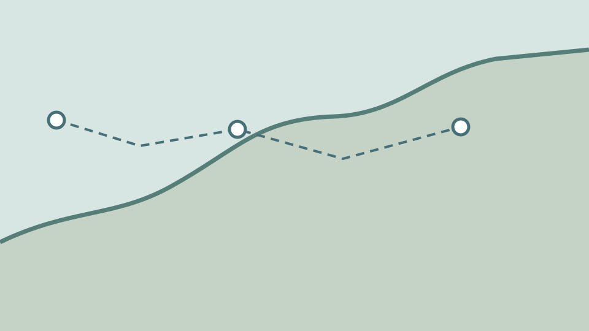

# Field notes from the shore

**Fictional sample.** The route and observations below demonstrate the extension; they are not survey data.

::::section{title="Follow the surveyed edge" id="shore" focus-frame="trace"}

The dashed route joins three observation points. As this section is read, a thin frame traces the boundary
of the sketch without changing or hiding the route. The drawing and this explanation remain
in the source order when motion is reduced or WebGL is unavailable.
::::

::::section{title="Record the observation" id="record"}
Use a dated field record for any real shoreline claim. This page carries no measurement or conclusion.
::::
