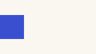

# Landing registry corpus

Corpus class: landing-page

Portable reports for agents, built locally.

:::section{title="Benefits" id="benefits" nav="Benefits" recipe="hero" place="flow" width="wide" align="center" tone="soft" composition="mosaic" viewport="bounded" section-density="immersive" type="display" media="natural" media-fit="contain" media-aspect="square" focal="top" surface="tint" frame="panel" transition="stagger" scene="progress" interaction="none" choreography="cascade" reveal="true" state="benefits-read"}
Section-level contract coverage.
:::

::::cards{title="Benefits"}
:::card{title="One file" href="#benefits"}
Share a self-contained artifact.
:::
:::card{title="No cloud" status="good" when="benefits-read"}
Compile and read offline.
:::
::::

:::actions{placement="edge"}
::action[Review benefits]{href="#benefits" kind="primary" effect="magnetic"}
::action[Read next]{href="next.html" kind="secondary"}
::action[Project site]{href="https://example.com/project" kind="quiet"}
:::

:::compare{before="Draft" after="Built"}


:::

::::::section{title="Scene" id="scene" scene="steps" transition="lines" media-effect="threads"}
:::diagram{title="Scene flow" description="Draft becomes page." layout="right" draw="scroll"}
::node{id="draft" label="Draft"}
::node{id="page" label="Page"}
::edge{from="draft" to="page" id="publish"}
:::

```sh
agentic-report build draft --output page.html
```

:::beat{title="Draft" focus="draft,publish" lines="1" state="drafted"}
We counted :count[1,284]{when="drafted"} drafts.
:::

:::beat
The page is built.
:::
::::::

::::section{title="Presented" id="presented" slide-transition="push"}
:::notes
Only for the speaker.
:::
::::

:::appear{effect="pop"}
Arrives on its step in a presentation.
:::

::contents{sticky="true"}

Reviews become :swap[faster]{words="calmer, exact"}; run :typing[agentic-report build page]; it passed :mark[three times]{shape="circle" seed="7"}.

:::spotlight{title="The detail" x="40" y="60" zoom="2.5"}


The detail the reader should see.
:::

::::section{title="Framed" id="framed" frame="browser" address="https://example.com/landing/" illustration="true" transition="log"}


```text
$ agentic-report build page
built page.html
```

::::

::::::demo{title="Played" play="time" seconds="2"}

```text
$ agentic-report build page
```

:::beat{title="Build"}
The page is built.
:::

:::beat{title="Open"}
The page is open.
:::
::::::

::::tabs{title="Scenarios" orientation="vertical"}
:::tab{label="First run"}
The first run.
:::
::::
