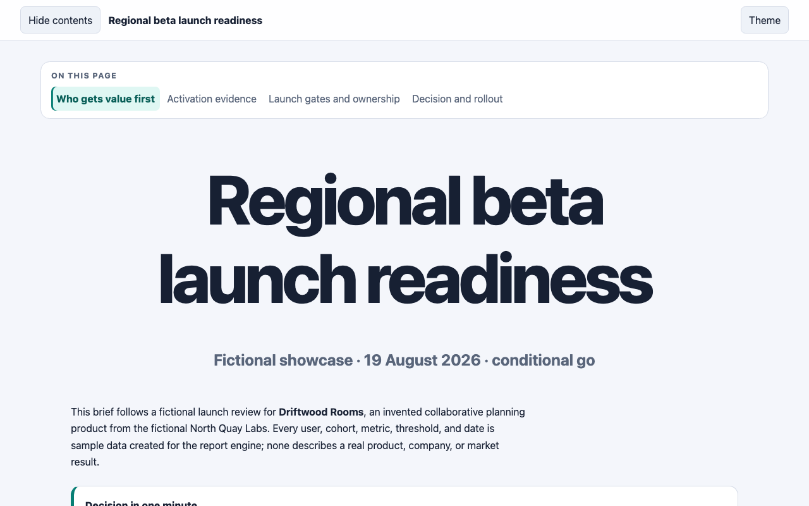
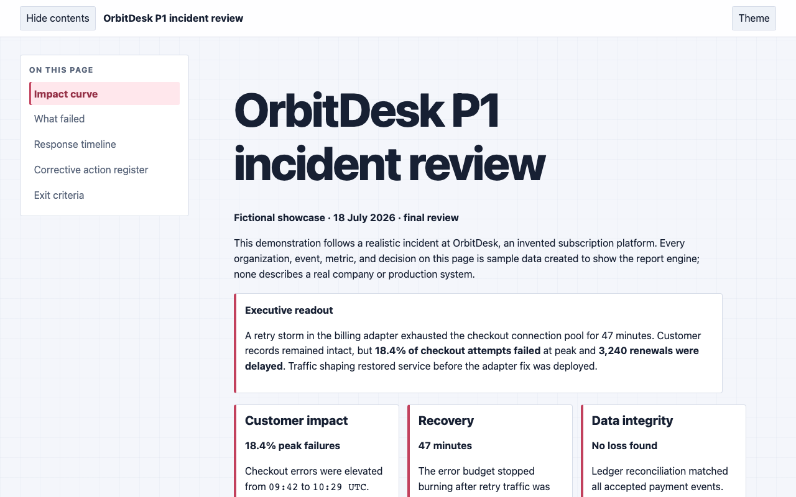
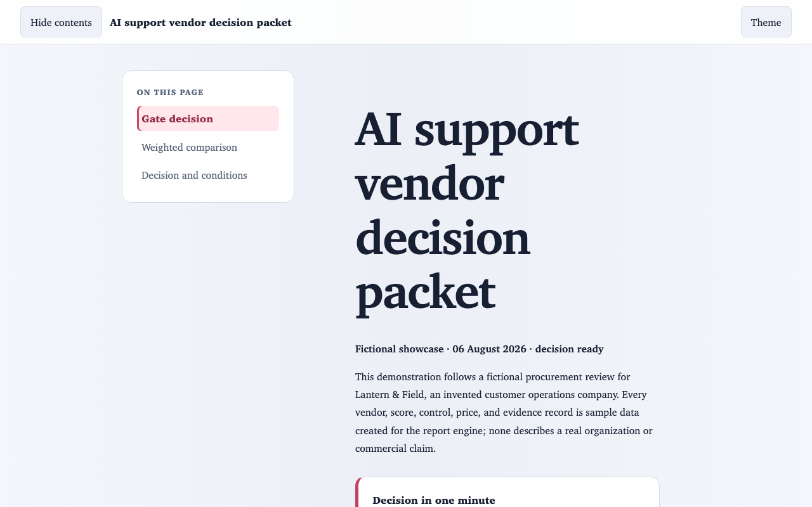

# Markdown in. An interactive page out.

**Declarative pages for agent handoffs**

Turn declarative Markdown into a finished interactive page an agent can hand to a human—locally, with one
build command and no frontend project.

```sh
npx --yes agentic-report init ./my-page --starter landing --json
```

::::actions
::action[Build your first page]{href="#workflow" kind="primary"}
::action[See examples]{href="#examples" kind="secondary"}
::action[Agent instructions]{href="docs/agent/index.md" kind="quiet"}
::::



_Fictional sample · built by agentic-report from the repository source._

::::cards
:::card{title="Single HTML by default"}
Choose a content-addressed directory artifact when the page is large.
:::
:::card{title="Opens directly through file://"}
The package-owned browser runtime is included and required for normal interactive output.
:::
:::card{title="No author JSX, JS, or CSS"}
Authors use Markdown, frontmatter, confined Markdown partials, and local assets.
:::
::::

:::::section{title="One source. A finished artifact." id="proof" nav="Proof" width="wide" align="start" tone="soft" reveal="true"}
The source on the left is a verbatim excerpt from the fictional launch example. The view on the right is an
actual local build of that same source, not a design mockup or a second private renderer.

::::cards
:::card{title="Verbatim declarative source"}

```markdown
---
contractVersion: 1
title: Regional beta launch readiness
description: A fictional launch decision combining audience value, activation evidence, operational gates, and a reversible rollout.
language: en
theme: light
layout: landing
preset: studio
tokens:
  accent: teal
---

# Regional beta launch readiness

**Fictional showcase · 19 August 2026 · conditional go**
```

[Read the complete launch source](examples/launch-readiness/source/report.md)
:::
:::card{title="Compiled result"}


The same compiler adds accessible navigation, interactive components, local assets, and its packaged
browser runtime.

[Open this fictional launch page](examples/launch-readiness/index.html)
:::
::::

:::callout{kind="info" title="This landing has its own public build path"}
The page you are reading is separately compiled from the [complete canonical landing source](source/landing/report.md).
The local compiler writes one self-contained HTML file by default. Directory output keeps the same page and runtime
behavior while moving content-addressed assets beside `index.html`; staging records the deployed identity in
[`release.json`](release.json).
:::

```sh
npx --yes agentic-report build ./website/landing --output ./site/index.html --json
```

[Read the landing source](source/landing/report.md) · [Inspect release identity](release.json)
:::::

:::::section{title="From empty folder to reviewable page." id="workflow" nav="Workflow" width="standard" align="start" tone="plain"}
Use Node.js 24.18.0 or newer. The first `npx` run needs registry and network access so npm can retrieve the
package; compilation and the generated page then run locally.

:::steps{title="First useful result"}

1. Initialize with `npx --yes agentic-report init ./my-page --starter landing --json`.
2. Edit the generated declarative Markdown and add only confined partials or local assets.
3. Run `npx --yes agentic-report validate ./my-page --json` and `npx --yes agentic-report inspect ./my-page --json`.
4. Run `npx --yes agentic-report build ./my-page --output ./my-page.html --json`, then open the result through `file://`.
   :::

:::callout{kind="warning" title="The runtime is part of the artifact"}
Authors do not write browser JavaScript, but normal generated pages are interactive and require the
package-owned runtime. Disabled-JavaScript and runtime-failure parity are not product profiles.
:::
:::::

:::::section{title="Realistic pages, not toy cards." id="examples" nav="Examples" width="wide" align="start" tone="soft" reveal="true"}
Each example is a separate publishable page compiled from public declarative source. Every organization,
person, event, metric, and decision is fictional sample data.

::::cards
:::card{title="OrbitDesk P1 incident review"}


**Fictional sample.** Reconstruct a 47-minute checkout incident from the failure curve, causal diagram,
evidence tabs, response timeline, and accountable action register.

**What to try:** switch the Evidence and limits tabs, then open the customer communication disclosure.

[Open live example](examples/incident-review/index.html) · [View declarative source](examples/incident-review/source/report.md)
:::
:::card{title="AI support vendor decision"}


**Fictional sample.** Separate non-negotiable procurement gates from weighted preference and inspect why
the highest-scoring candidate is not eligible.

**What to try:** open the ranking explanation and the reviewer evidence checklist.

[Open live example](examples/vendor-decision/index.html) · [View declarative source](examples/vendor-decision/source/report.md)
:::
:::card{title="Regional beta launch readiness"}


**Fictional sample.** Judge a bounded beta from activation, retention, operational gates, a hold condition,
and a reversible rollout.

**What to try:** switch the audience tabs and reveal the automatic hold condition.

[Open live example](examples/launch-readiness/index.html) · [View declarative source](examples/launch-readiness/source/report.md)
:::
::::
:::::

:::::section{title="Built for handoff, across seven page types." id="page-types" nav="Page types" width="wide" align="start" tone="plain"}
::::cards
:::card{title="Report"}
Turn findings, evidence, decisions, and owned follow-up into a reviewable handoff. Start with `report`.
:::
:::card{title="Research"}
Present method, competing evidence, confidence, and a bounded recommendation. Start with `research`.
:::
:::card{title="Architecture"}
Explain system boundaries, alternatives, trade-offs, and a rollout. Start with `architecture`.
:::
:::card{title="Tutorial"}
Guide a reader through ordered steps, code, progressive detail, and bounded practice. Start with `tutorial`.
:::
:::card{title="Dashboard"}
Make operating signals, charts, filters, thresholds, and exceptions easy to scan. Start with `dashboard`.
:::
:::card{title="Decision"}
Separate gates, evidence, alternatives, conditions, and reversibility. Use the existing `report` or
`architecture` starter; the [fictional vendor decision](examples/vendor-decision/index.html) is the proof,
not a made-up seventh starter.
:::
:::card{title="Landing"}
Build a restrained proof-first product or project page with the same public engine. Start with `landing`.
:::
::::

:::callout{kind="success" title="One contract, different reader jobs"}
Every page keeps declarative source, an inspectable build, an interactive human handoff, and a portable local
artifact. A starter shapes authoring; `single-file` and `directory` are output formats, not templates.
:::
:::::

:::::section{title="This site is one of the outputs." id="landing-pages" nav="Landing pages" width="wide" align="start" tone="accent" reveal="true"}
The public site uses the same section, navigation, preset, action, local-asset, and restrained-motion
contracts as every other page. There is no landing-only renderer, hidden theme, author stylesheet, or
post-build DOM patch.

::::cards
:::card{title="Build proof"}

```sh
npx --yes agentic-report build ./website/landing --output ./site/index.html --json
```

[Read the complete source](source/landing/report.md) · [Open the landing starter](source/starter/landing/report.md) · [Release identity](release.json)
:::
:::card{title="Ordinary engine features"}

- eight semantic sections derived into navigation;
- the reusable `studio` preset and responsive content tracks;
- ordinary safe action links and local screenshots;
- one optional progress line and three bounded one-time reveals.
  :::
  ::::
  :::::

:::::section{title="Know what it does—and what it doesn’t." id="boundaries" nav="Boundaries" width="standard" align="start" tone="plain"}
::::cards
:::card{title="Included"}

- a local declarative compiler;
- confined Markdown, partials, and local assets;
- deterministic validate, inspect, and build commands with structured JSON output;
- a required package-owned interactive runtime;
- single-file output by default and optional directory output.
  :::
  :::card{title="Not included"}
- a hosted editor, backend, or collaboration service;
- deployment or account management;
- arbitrary author HTML, JSX, CSS, or browser JavaScript;
- remote source, asset, script, font, or style fetching;
- print or disabled-JavaScript parity.
  :::
  ::::

[Architecture](docs/agent/reference.md) · [Source contract](docs/source-contract/index.md) · [MIT license](https://github.com/witqq/agentic-report/blob/main/LICENSE)
:::::

:::::section{title="For humans and agents." id="docs" nav="Docs" width="wide" align="start" tone="soft"}
::::cards
:::card{title="Human guide"}
Start with the page you need, then follow task-oriented commands and examples.

[Read the guide](docs/index.html)
:::
:::card{title="Agent guide"}
Retrieve concise Markdown directly with an ordinary file or HTTP request—no checkout, authentication, or
browser JavaScript required.

[Open agent instructions](docs/agent/index.md) · [Read llms.txt](llms.txt)
:::
:::card{title="Source contract and skill"}
Use the closed authoring reference and canonical skill without downloading a documentation application.

[Read the source contract](docs/source-contract/index.md) · [Open the skill](skills/agentic-report/SKILL.md)
:::
::::

`agentic-report --help`, `validate --json`, and `inspect --json` remain the local executable truth.
:::::

:::::section{title="Build the page your agent needs to hand off." id="start" nav="Start" width="standard" align="center" tone="contrast"}
Use Node.js 24.18.0 or newer. The first zero-install run retrieves the package from the npm registry.

```sh
npx --yes agentic-report init ./my-page --starter landing --json
```

::::actions
::action[Read the quick start]{href="docs/index.html" kind="primary"}
::action[Explore examples]{href="#examples" kind="secondary"}
::action[View the repository]{href="https://github.com/witqq/agentic-report" kind="quiet"}
:::::

No signup, hosted project, or telemetry promise is required to produce the local artifact.
::::
