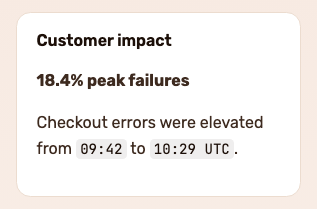
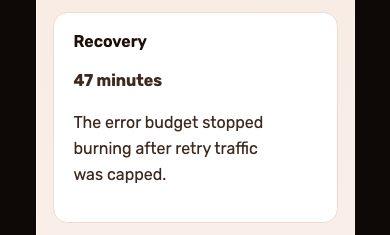
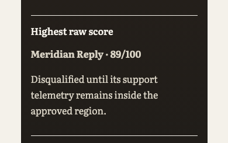
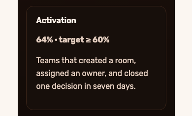

# A finished page from Markdown.

Install the skill, then give your agent the page task.

::::actions{placement="inline"}
::action[Build a page]{href="#workflow" kind="primary"}
::action[See examples]{href="#examples" kind="secondary"}
::::

```sh
npx skills add \
  witqq/agentic-report \
  --skill agentic-report
```

::::::section{title="From source to a real report" id="demo" nav="Source to page" recipe="demo" place="opening" media-aspect="landscape" media-fit="cover"}

Fictional incident · 18 July 2026 · [`18.4% peak failures`](examples/incident-review/report.md).



[Open the finished report](examples/incident-review/index.html)

::::::

::::::section{title="The same source can speak in another voice." id="styles" nav="Change the look" recipe="statement" transition="none"}
:::lead
Try the theme selector in the top bar. It restyles this very page without changing its Markdown. Each theme
coordinates type, surfaces, controls, and motion; a custom theme can carry a product's own identity.
:::

::::disclosure{title="Compare page styles and their live examples" open="false"}

| Example                                                           | What its form serves                                                       |
| ----------------------------------------------------------------- | -------------------------------------------------------------------------- |
| [Decision report · Calm paper](examples/document/index.html)      | Evidence, decisions, risks, and accountable next actions.                  |
| [Research brief · Aurora](examples/research/index.html)           | Method, sources, comparison, uncertainty, and recommendation.              |
| [Blueprint dashboard](examples/dashboard/index.html)              | Operational scanning with charts, filters, state, and compact controls.    |
| [Terminal portfolio](examples/terminal-portfolio/index.html)      | Prompt rhythm, mono type, and linked work cards.                           |
| [Cinematic story](examples/cinematic-story/index.html)            | Local imagery, a staged hero, scroll narrative, media rail, and close.     |
| [Executive brief · Daylight](examples/executive-brief/index.html) | Evidence, an operating path, and a handoff in a bright theme.              |
| [Motion and depth showcase](examples/motion-showcase/index.html)  | Scroll progress, reveal, depth, tilt, and reduced-motion fallback.         |
| [Landing starter](examples/landing/index.html)                    | A product narrative, clear actions, portable proof, and explicit boundary. |

::::

::::actions{placement="inline"}
::action[Browse the complete visual catalog]{href="examples/visual-catalog/index.html" kind="primary"}
::action[Open the interactive catalog]{href="examples/interactive-catalog/index.html" kind="secondary"}
::::
::::::

::::::section{title="From brief to page in one local build." id="workflow" surface="plain" nav="Build a page" recipe="evidence"}
An agent starts with the reader's job, edits the Markdown, and builds the artifact. The common path does not
ask the agent to design a layout system or set up a frontend project.

:::steps{title="The primary author path"}

1. Initialize the page category closest to the reader's task.
2. Replace the sample with real content and local assets that explain it.
3. Build once; open the portable result through `file://` and inspect it.
   :::

```sh
npx --yes agentic-report init ./my-page --starter document --json
npx --yes agentic-report build ./my-page --output ./my-page.html --json
```

:::callout{kind="info" title="The checks are part of the build"}
`build` validates syntax, paths, and component contracts before writing. Use `validate` or `inspect` when an
agent needs a focused diagnosis; look at the built page before handing it over.
:::

::::actions{placement="inline"}
::action[Read the agent quickstart]{href="docs/agent/index.md" kind="primary"}
::action[Open the source contract]{href="docs/product/source-contract.md" kind="secondary"}
::::
::::::

::::::section{title="Different jobs. The same author path." id="examples" nav="Real page proofs" recipe="rail"}
These are captured from pages built by the package, not design mockups. The scenarios and their people,
organizations, incidents, metrics, and decisions are fictional; the rendered pages and interactions are real.
Each live example has maintained English and Russian content.

::::cards
:::card{title="Incident command review" href="examples/incident-review/index.html"}


Fictional case · 18 July 2026. Impact, causal evidence, response timeline, and owned follow-up.
:::
:::card{title="Vendor decision" href="examples/vendor-decision/index.html"}


Fictional case · 6 August 2026. Hard gates, weighted evidence, a ranking exception, and conditional adoption.
:::
:::card{title="Launch readiness" href="examples/launch-readiness/index.html"}


Fictional case · 19 August 2026. Audience value, activation evidence, operating gates, and a reversible rollout.
:::
::::

::::disclosure{title="Open more page types" open="false"}

- [Architecture decision](examples/architecture/index.html): trust boundary, alternatives, diagram, review checklist, and rollout path.
- [First-page tutorial](examples/tutorial/index.html): a build journey with tabs, progressive detail, and a practice control.
- [Visualization atlas](examples/visualization-catalog/index.html): charts, flow and sequence diagrams, and a timeline.
- [Executive decision brief](examples/executive-brief/index.html): evidence, operating path, and handoff in Daylight.
- [Motion and depth](examples/motion-showcase/index.html): declarative motion with its reduced-motion fallback.
- [Code review](examples/code-review/index.html): verdict, severity, and a unified diff with old and new line numbers.
- [A question to answer](examples/answer/index.html): trade-offs and a form that exports one structured answer.
- [Open questions](examples/question-review/index.html): migration questions with context and a shared answer form.
- [A presentation](examples/presentation/index.html): slides, click steps, speaker notes, and a film view.

::::

[Report source](examples/document/report.md) · [Research](examples/research/report.md) ·
[Architecture](examples/architecture/report.md) · [Tutorial](examples/tutorial/report.md) ·
[Dashboard](examples/dashboard/report.md) · [Landing](examples/landing/report.md) ·
[Visual catalog](examples/visual-catalog/report.md) · [Interactions](examples/interactive-catalog/report.md) ·
[Visualizations](examples/visualization-catalog/report.md) · [Terminal](examples/terminal-portfolio/report.md) ·
[Cinematic](examples/cinematic-story/report.md) ·
[Executive brief](examples/executive-brief/report.md) ·
[Motion showcase](examples/motion-showcase/report.md) ·
[Run report from data](examples/run-report/report.md) ([page](examples/run-report/index.html)) ·
[Incident review](examples/incident-review/report.md) ·
[Vendor decision](examples/vendor-decision/report.md) ·
[Launch readiness](examples/launch-readiness/report.md) ·
[Code review](examples/code-review/report.md) · [Answer](examples/answer/report.md) ·
[Presentation](examples/presentation/report.md) ·
[Questions](examples/question-review/report.md)
::::::

::::::section{title="Feedback stays with the words." id="review" nav="Review in place"}
Review is active on this page. Select eligible text and choose **Create note**: the selection stays marked,
and the thread opens next to it. Readers can reply, edit, resolve, reopen, export, or jump to the discussion
without moving the document into a separate editor.

:::callout{kind="success" title="Try it here"}
Select any words in this sentence. The note opens by the selection; the top-bar Review control collects and
exports the threads.
:::

::::actions{placement="inline"}
::action[Open the Review workspace]{href="examples/review-workspace/index.html" kind="primary"}
::action[Open structured Response]{href="examples/response-workspace/index.html" kind="secondary"}
::::

[Review source](examples/review-workspace/report.md) ·
[Prior review example](examples/review-workspace/prior-review.json)
::::::

::::::section{title="The layout work lives in the package." id="reasons" nav="How it works" recipe="blueprint"}
The agent writes the reader's content and selects a theme or recipe when the task needs one. The compiler
checks the declared source, then package-owned components produce the responsive page.

::::diagram{title="From source to handoff" description="Declared Markdown is checked, composed with package-owned components, and built into a portable page." type="flow" direction="right"}
::node{id="source" label="Markdown source"}
::node{id="check" label="Contract checks"}
::node{id="compose" label="Theme + components"}
::node{id="output" label="Portable page"}
::edge{from="source" to="check"}
::edge{from="check" to="compose"}
::edge{from="compose" to="output"}
::::

Single-file output is the default; directory output serves larger published pages. Both preserve semantic
HTML, localization, and any declared Review or Response behavior. Source truth and final visual inspection stay
with the agent; build checks do not approve the meaning of authored content.
::::::

::::::section{title="The skill knows the tool's whole vocabulary." id="agent-skill" nav="Set up an agent"}
The install line is on the first screen. Give the agent a brief for an interactive research handoff, code
tour, decision packet, tutorial, dashboard, or landing. The skill routes it to exact CLI, source, Node, and
extension references when needed while keeping the ordinary init/edit/build/open path short.

::::actions{placement="inline"}
::action[Read the exact skill]{href="skills/agentic-report/SKILL.md" kind="primary"}
::action[Read agent instructions]{href="docs/agent/index.md" kind="secondary"}
::action[Browse packaged examples]{href="examples/manifest.json" kind="quiet"}
::::

[Open the packaged landing starter source](source/starter/landing/report.md)
::::::

::::::section{title="A finished page, with a clear boundary." id="boundaries" surface="plain" nav="Start here" recipe="statement"}
The ordinary source is Markdown, frontmatter, confined partials, theme data, and local assets. It can build
one portable HTML file or a directory with content-addressed resources. Raw HTML, remote fetching, and
implicit code execution are outside that source format; declared extensions have their own checks and trust
boundary. Hosted collaboration, PDF export, pagination, and disabled-JavaScript parity are outside the
product.

::::actions{placement="bottom"}
::action[Build the first page]{href="docs/index.html" kind="primary"}
::action[Explore every live example]{href="#examples" kind="secondary"}
::action[View the repository]{href="https://github.com/witqq/agentic-report" kind="quiet"}
::::

[English source](source/landing/report.md) · [Russian source](source/landing/report.ru.md) ·
[Public route manifest](website/routes.json) · [Release identity](release.json)
::::::
