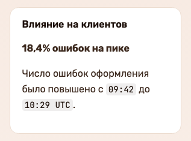
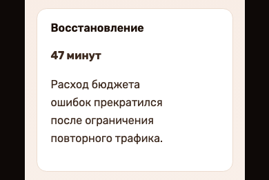
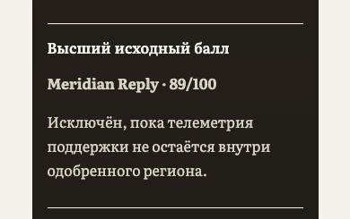
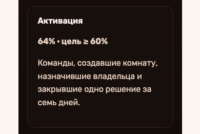

# Страница из Markdown.

Установите навык и поручите агенту собрать страницу.

::::actions{placement="inline"}
::action[Собрать страницу]{href="#workflow" kind="primary"}
::action[Примеры]{href="#examples" kind="secondary"}
::::

```sh
npx skills add \
  witqq/agentic-report \
  --skill agentic-report
```

::::::section{title="От исходника к готовому отчёту" id="demo" nav="Из исходника в страницу" recipe="demo" place="opening" media-aspect="landscape" media-fit="cover"}

Вымышленный случай · 18.07.2026 · [`18,4% ошибок на пике`](examples/incident-review/report.ru.md).



[Открыть готовый отчёт](examples/incident-review/index.html)

::::::

::::::section{title="Один исходник — разные визуальные решения." id="styles" nav="Изменить оформление" recipe="statement" transition="none"}
:::lead
Попробуйте переключатель темы в верхней строке. Оформление этой страницы изменится без правок Markdown.
Каждая тема согласует шрифты, поверхности, элементы управления и движение. Для фирменного оформления можно
создать собственную тему.
:::

::::disclosure{title="Сравнить стили страниц и живые примеры" open="false"}

| Пример                                                             | Для какой задачи подходит                                                                    |
| ------------------------------------------------------------------ | -------------------------------------------------------------------------------------------- |
| [Отчёт о решении · Calm paper](examples/document/index.html)       | Доказательства, решения, риски и дальнейшие действия с ответственными.                       |
| [Исследование · Aurora](examples/research/index.html)              | Метод, источники, сравнение, неопределённость и рекомендация.                                |
| [Панель Blueprint](examples/dashboard/index.html)                  | Быстрый обзор показателей с графиками, фильтрами, состояниями и компактным управлением.      |
| [Терминальное портфолио](examples/terminal-portfolio/index.html)   | Ритм команд, моноширинный шрифт и карточки работ со ссылками.                                |
| [Кинематографическая история](examples/cinematic-story/index.html) | Локальные изображения, выразительное вступление, рассказ при прокрутке, медиалента и финал.  |
| [Краткий отчёт · Daylight](examples/executive-brief/index.html)    | Доказательства, порядок действий и передача результата в светлой теме.                       |
| [Движение и глубина](examples/motion-showcase/index.html)          | Прогресс прокрутки, появление элементов, глубина, наклон и вариант с ограниченным движением. |
| [Заготовка лендинга](examples/landing/index.html)                  | Рассказ о продукте, ясные действия, переносимый пример и явные границы.                      |

::::

::::actions{placement="inline"}
::action[Открыть полный визуальный каталог]{href="examples/visual-catalog/index.html" kind="primary"}
::action[Открыть каталог взаимодействий]{href="examples/interactive-catalog/index.html" kind="secondary"}
::::
::::::

::::::section{title="От задачи до страницы за одну локальную сборку." id="workflow" surface="plain" nav="Собрать страницу" recipe="evidence"}
Агент начинает с задачи читателя, правит Markdown и собирает страницу. В обычном сценарии ему не нужно
проектировать компоновку или настраивать фронтенд-проект.

:::steps{title="Основной путь автора"}

1. Создайте заготовку, которая ближе всего к задаче читателя.
2. Замените образец содержимым и локальными ресурсами, которые помогают его понять.
3. Соберите страницу, откройте переносимый результат через `file://` и проверьте его.
   :::

```sh
npx --yes agentic-report init ./my-page --starter document --json
npx --yes agentic-report build ./my-page --output ./my-page.html --json
```

:::callout{kind="info" title="Проверки входят в сборку"}
`build` проверяет синтаксис, пути и контракты компонентов перед записью файла. Для точечной диагностики есть
`validate` и `inspect`. Перед передачей результата посмотрите собранную страницу.
:::

::::actions{placement="inline"}
::action[Прочитать быстрый старт для агента]{href="docs/agent/index.md" kind="primary"}
::action[Открыть контракт исходника]{href="docs/product/source-contract.md" kind="secondary"}
::::
::::::

::::::section{title="Разные задачи. Один способ собрать страницу." id="examples" nav="Готовые страницы" recipe="rail"}
Эти снимки сделаны с настоящих страниц, собранных пакетом. Люди, организации, инциденты, показатели и
решения в примерах вымышлены; страницы и взаимодействия работают. Для каждого живого примера поддерживаются
английский и русский тексты.

::::cards
:::card{title="Разбор инцидента" href="examples/incident-review/index.html"}


Вымышленный случай · 18 июля 2026 года. Влияние, причинные данные, хронология реакции и ответственные за дальнейшие действия.
:::
:::card{title="Выбор поставщика" href="examples/vendor-decision/index.html"}


Вымышленный случай · 6 августа 2026 года. Обязательные условия, взвешенные данные, исключение из рейтинга и условное решение.
:::
:::card{title="Готовность запуска" href="examples/launch-readiness/index.html"}


Вымышленный случай · 19 августа 2026 года. Ценность для аудитории, данные активации, операционные условия и обратимый запуск.
:::
::::

::::disclosure{title="Открыть другие типы страниц" open="false"}

- [Архитектурное решение](examples/architecture/index.html): граница доверия, альтернативы, схема, проверка и порядок внедрения.
- [Руководство по первой странице](examples/tutorial/index.html): сборка с вкладками, постепенным раскрытием и упражнением.
- [Атлас визуализаций](examples/visualization-catalog/index.html): графики, потоковые и последовательные схемы, хронология.
- [Краткий отчёт для руководителя](examples/executive-brief/index.html): доказательства, порядок действий и передача результата в Daylight.
- [Движение и глубина](examples/motion-showcase/index.html): декларативное движение и вариант при ограниченной анимации.
- [Ревью кода](examples/code-review/index.html): вердикт, серьёзность находок и единый дифф с номерами старых и новых строк.
- [Вопрос, на который нужен ответ](examples/answer/index.html): компромиссы и форма, которая выгружает один структурированный ответ.
- [Открытые вопросы](examples/question-review/index.html): вопросы о переезде с контекстом и общей формой ответа.
- [Презентация](examples/presentation/index.html): слайды, шаги по щелчку, заметки докладчика и режим для записи видео.

::::

[Отчёт](examples/document/report.ru.md) · [Исследование](examples/research/report.ru.md) ·
[Архитектура](examples/architecture/report.ru.md) · [Руководство](examples/tutorial/report.ru.md) ·
[Панель](examples/dashboard/report.ru.md) · [Лендинг](examples/landing/report.ru.md) ·
[Визуальный каталог](examples/visual-catalog/report.ru.md) · [Взаимодействия](examples/interactive-catalog/report.ru.md) ·
[Визуализации](examples/visualization-catalog/report.ru.md) · [Terminal](examples/terminal-portfolio/report.ru.md) ·
[Cinematic](examples/cinematic-story/report.ru.md) ·
[Краткий отчёт](examples/executive-brief/report.ru.md) ·
[Движение](examples/motion-showcase/report.ru.md) ·
[Отчёт о прогоне из данных](examples/run-report/report.ru.md) ([страница](examples/run-report/index.html)) ·
[Инцидент](examples/incident-review/report.ru.md) ·
[Выбор поставщика](examples/vendor-decision/report.ru.md) ·
[Готовность запуска](examples/launch-readiness/report.ru.md) ·
[Ревью кода](examples/code-review/report.ru.md) · [Вопрос с ответом](examples/answer/report.ru.md) ·
[Презентация](examples/presentation/report.ru.md) ·
[Вопросы](examples/question-review/report.ru.md)
::::::

::::::section{title="Замечания остаются рядом с текстом." id="review" nav="Ревью на странице"}
Ревью включено на этой странице. Выделите подходящий текст и выберите **Создать заметку**: выделение
останется отмеченным, а ветка обсуждения откроется рядом. Читатель может ответить, отредактировать заметку,
закрыть и вновь открыть обсуждение, экспортировать его или перейти к нему. Переносить документ в отдельный
редактор не нужно.

:::callout{kind="success" title="Попробуйте здесь"}
Выделите несколько слов в этом предложении. Заметка появится рядом с выделением; кнопка **Ревью** в верхней
строке собирает ветки обсуждения и позволяет их экспортировать.
:::

::::actions{placement="inline"}
::action[Открыть пространство Review]{href="examples/review-workspace/index.html" kind="primary"}
::action[Открыть структурированный Response]{href="examples/response-workspace/index.html" kind="secondary"}
::::

[Русский исходник Review](examples/review-workspace/report.ru.md) ·
[Пример прежнего ревью](examples/review-workspace/prior-review.json)
::::::

::::::section{title="Компоновку берёт на себя пакет." id="reasons" nav="Как это работает" recipe="blueprint"}
Агент пишет текст для читателя и, когда нужно, выбирает тему или рецепт раздела. Компилятор проверяет
декларативный исходник, а компоненты пакета собирают адаптивную страницу.

::::diagram{title="От исходника до передачи" description="Декларативный Markdown проходит проверку, соединяется с компонентами пакета и превращается в переносимую страницу." type="flow" direction="right"}
::node{id="source" label="Исходник Markdown"}
::node{id="check" label="Проверка контракта"}
::node{id="compose" label="Тема и компоненты"}
::node{id="output" label="Переносимая страница"}
::edge{from="source" to="check"}
::edge{from="check" to="compose"}
::edge{from="compose" to="output"}
::::

По умолчанию результат — один HTML-файл; для больших опубликованных страниц есть сборка в каталог. В обоих
случаях сохраняются семантический HTML, локализация и объявленные возможности Review и Response. За точность исходных данных и итоговую
визуальную проверку отвечает агент: сборка не оценивает смысл написанного.
::::::

::::::section{title="Навык знает весь словарь инструмента." id="agent-skill" nav="Настроить агента"}
Команда установки уже показана в начале страницы. Поручите агенту интерактивное исследование, обзор кода,
пакет материалов для решения, руководство, панель или лендинг. Навык при необходимости ведёт к точным
справочникам по CLI, исходнику, Node API и расширениям. Для обычной задачи путь остаётся коротким: создать,
отредактировать, собрать и открыть.

::::actions{placement="inline"}
::action[Прочитать точный навык]{href="skills/agentic-report/SKILL.md" kind="primary"}
::action[Открыть инструкции агента]{href="docs/agent/index.md" kind="secondary"}
::action[Посмотреть упакованные примеры]{href="examples/manifest.json" kind="quiet"}
::::

[Открыть исходник заготовки лендинга](source/starter/landing/report.md)
::::::

::::::section{title="Готовая страница с ясными границами." id="boundaries" surface="plain" nav="Начать" recipe="statement"}
Обычный исходник состоит из Markdown, метаданных в начале файла, включений внутри каталога проекта, данных
темы и локальных ресурсов. Результат можно собрать в один переносимый HTML-файл или в каталог с ресурсами,
названными по хешу содержимого. Сырой HTML, загрузка из сети и неявное исполнение кода не входят в этот
формат; объявленные расширения проходят отдельные проверки и имеют собственную границу доверия. Облачная
совместная работа, экспорт PDF, пагинация и работа без JavaScript в продукт не входят.

::::actions{placement="bottom"}
::action[Собрать первую страницу]{href="docs/index.html" kind="primary"}
::action[Изучить все живые примеры]{href="#examples" kind="secondary"}
::action[Открыть репозиторий]{href="https://github.com/witqq/agentic-report" kind="quiet"}
::::

[Исходник заготовки лендинга](source/starter/landing/report.md) ·
[Английский исходник](source/landing/report.md) · [Русский исходник](source/landing/report.ru.md) ·
[Манифест публичных маршрутов](website/routes.json) · [Идентификатор выпуска](release.json)
::::::
