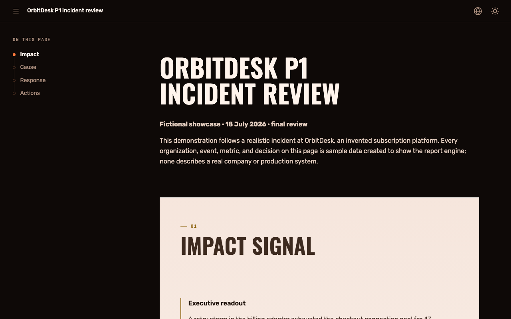
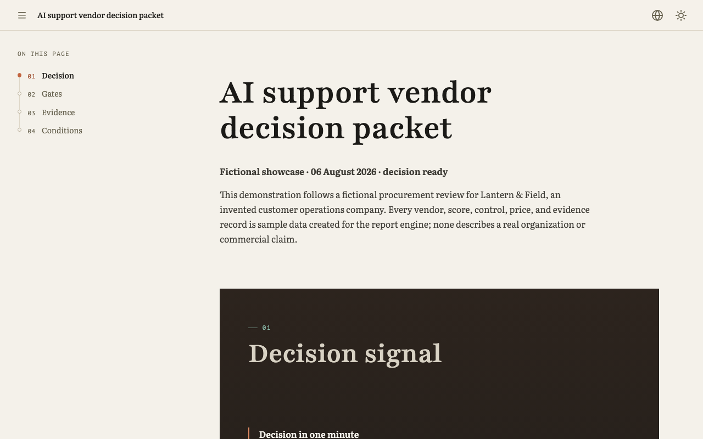
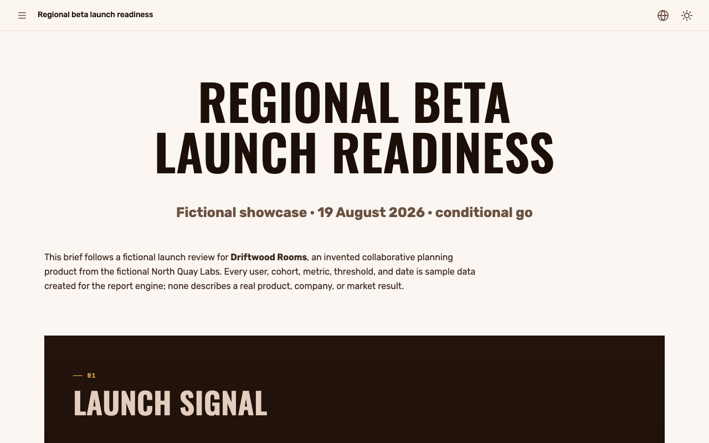

# Страница, которую хочется передать. Из Markdown.

Один декларативный исходник превращается в готовый интерактивный отчёт, руководство, панель или визуальную историю.

Для обычной страницы не нужны фронтенд-проект, облачный редактор и авторский JavaScript. `agentic-report`
по умолчанию локально собирает один переносимый HTML-файл с адаптивной композицией, взаимодействиями и локализацией. Ревью выделенного
текста и переключатель темы для читателя включаются каждый своим флагом в метаданных.

::::actions{placement="edge"}
::action[Собрать первую страницу]{href="#workflow" kind="primary"}
::action[Выбрать визуальный характер]{href="#styles" kind="secondary"}
::action[Открыть живые примеры]{href="#examples" kind="quiet"}
::::

::::::section{title="Markdown на входе, страница на выходе" id="demo" nav="Демо" recipe="demo" place="opening"}

```md
::::cards
:::card{title="Сборка" status="good"}
Один HTML-файл, который открывается с диска.
:::
:::card{title="Ревью" status="watch"}
Две заметки ждут ответа.
:::
::::
```

::::cards
:::card{title="Сборка" status="good"}
Один HTML-файл, который открывается с диска.
:::
:::card{title="Ревью" status="watch"}
Две заметки ждут ответа.
:::
::::
::::::

::::::section{title="Выберите результат, затем его характер." id="styles" nav="Выбрать результат" recipe="rail"}
:::lead
Начните с задачи читателя. Тема объединяет шрифты, фон, отступы, элементы управления, медиа и движение;
при желании её можно расширить собственной темой. Рецепты разделов строят рассказ без
длинной стены визуальных атрибутов. На этой странице включён переключатель темы: выберите другую в верхней
строке, и тот же исходник перестроится на лету.
:::







::::cards
:::card{title="Отчёт о решении · Calm paper" href="examples/document/index.html"}
Чёткая иерархия для доказательств, решений, рисков и дальнейших действий с ответственными.
:::
:::card{title="Исследование · Aurora" href="examples/research/index.html"}
Развёрнутая подача метода, источников, сравнения, сомнений и рекомендации.
:::
:::card{title="Панель Blueprint" href="examples/dashboard/index.html"}
Контрастный операционный обзор с графиками, фильтрами, состояниями и компактным управлением.
:::
:::card{title="Терминальное портфолио" href="examples/terminal-portfolio/index.html"}
Моноширинный шрифт, ритм команд, сканирующая текстура, курсор и заметные ссылки на работы.
:::
:::card{title="Кинематографическая история" href="examples/cinematic-story/index.html"}
Локальные изображения задают выразительное вступление, ведут рассказ при прокрутке, медиаленту и финал.
:::
:::card{title="Краткий отчёт · Daylight" href="examples/executive-brief/index.html"}
Решительное вступление, просторный блок с доказательствами, порядок действий и готовая передача результата
в светлом оформлении Daylight.
:::
:::card{title="Движение и глубина" href="examples/motion-showcase/index.html"}
Прогресс прокрутки, появление элементов, каскад, глубина и наклон. Если в системе отключена анимация,
страница сохраняет содержание и порядок чтения.
:::
:::card{title="Заготовка лендинга" href="examples/landing/index.html"}
Собранный рассказ о продукте с ясными действиями, примером для локального просмотра и чёткими границами.
:::
::::

::::actions{placement="inline"}
::action[Открыть полный визуальный каталог]{href="examples/visual-catalog/index.html" kind="primary"}
::action[Открыть каталог взаимодействий]{href="examples/interactive-catalog/index.html" kind="secondary"}
::::
::::::

::::::section{title="Три шага от пустой папки до готовой страницы." id="workflow" surface="plain" nav="Собрать страницу" recipe="story"}


:::steps{title="Основной путь автора"}

1. Создайте заготовку, которая ближе всего к задаче читателя.
2. Замените примерный Markdown и добавьте нужные локальные ресурсы из каталога проекта.
3. Соберите страницу и откройте настоящий артефакт через `file://`.
   :::

```sh
npx --yes agentic-report init ./my-page --starter research --json
npx --yes agentic-report build ./my-page --output ./my-page.html --json
```

:::callout{kind="info" title="Расширенная диагностика остаётся необязательной"}
`build` проверяет исходник перед записью. Команды `validate` и `inspect` нужны только для точечной
диагностики; обычный путь не требует отдельного шага проверки.
:::

::::actions{placement="inline"}
::action[Прочитать быстрый старт для агента]{href="docs/agent/index.md" kind="primary"}
::action[Открыть контракт исходника]{href="docs/product/source-contract.md" kind="secondary"}
::::
::::::

::::::section{title="Живые страницы для разных задач читателя." id="examples" nav="Изучить примеры" recipe="evidence"}
Люди, организации, инциденты, показатели и решения в примерах вымышлены. Каждая страница собирается
отдельно и содержит равнозначные тексты на русском и английском.

::::cards
:::card{title="Разбор инцидента" href="examples/incident-review/index.html"}
Динамика влияния, причинная схема, хронология реакции и ответственные действия.
:::
:::card{title="Выбор поставщика" href="examples/vendor-decision/index.html"}
Обязательные условия закупки, взвешенные данные, исключение из рейтинга и условное решение.
:::
:::card{title="Готовность запуска" href="examples/launch-readiness/index.html"}
Ценность для аудитории, активация, операционные условия и обратимый запуск.
:::
:::card{title="Архитектурное решение" href="examples/architecture/index.html"}
Граница доверия, альтернативы, схема, чек-лист ревью и порядок внедрения.
:::
:::card{title="Руководство по первой странице" href="examples/tutorial/index.html"}
Пошаговая сборка с вкладками, постепенным раскрытием и небольшим интерактивным упражнением.
:::
:::card{title="Атлас визуализаций" href="examples/visualization-catalog/index.html"}
Графики, поток, последовательность и хронология из проверяемых директив.
:::
:::card{title="Краткий отчёт для руководителя" href="examples/executive-brief/index.html"}
Оформление Daylight для решения, построенного вокруг доказательств и дальнейших действий.
:::
:::card{title="Демонстрация движения" href="examples/motion-showcase/index.html"}
Наглядный обзор визуальных эффектов, доступных через обычные декларативные роли.
:::
:::card{title="Ревью кода" href="examples/code-review/index.html"}
Вердикт, находки по серьёзности и единый дифф с номерами старых и новых строк.
:::
:::card{title="Вопрос, на который нужен ответ" href="examples/answer/index.html"}
Три варианта с их ценой и форма, которая выгружает один структурированный ответ.
:::
:::card{title="Открытые вопросы" href="examples/question-review/index.html"}
Три нерешённых вопроса переезда, у каждого свой контекст, и одна форма для всех ответов.
:::
:::card{title="Презентация" href="examples/presentation/index.html"}
Слайды с шагами по щелчку, заметками докладчика и режимом съёмки с отдельным адресом для каждого слайда.
:::
::::

[Отчёт](examples/document/report.ru.md) · [Исследование](examples/research/report.ru.md) ·
[Архитектура](examples/architecture/report.ru.md) · [Руководство](examples/tutorial/report.ru.md) ·
[Панель](examples/dashboard/report.ru.md) · [Лендинг](examples/landing/report.ru.md) ·
[Визуальный каталог](examples/visual-catalog/report.ru.md) · [Взаимодействия](examples/interactive-catalog/report.ru.md) ·
[Визуализации](examples/visualization-catalog/report.ru.md) · [Terminal](examples/terminal-portfolio/report.ru.md) ·
[Cinematic](examples/cinematic-story/report.ru.md) · [Краткий отчёт](examples/executive-brief/report.ru.md) ·
[Движение](examples/motion-showcase/report.ru.md) · [Отчёт о прогоне из данных](examples/run-report/report.ru.md) ([страница](examples/run-report/index.html)) · [Инцидент](examples/incident-review/report.ru.md) ·
[Выбор поставщика](examples/vendor-decision/report.ru.md) · [Готовность запуска](examples/launch-readiness/report.ru.md) ·
[Ревью кода](examples/code-review/report.ru.md) · [Вопрос с ответом](examples/answer/report.ru.md) ·
[Презентация](examples/presentation/report.ru.md) ·
[Вопросы](examples/question-review/report.ru.md)
::::::

::::::section{title="Комментируйте там, где возник вопрос." id="review" nav="Ревью на месте" recipe="evidence" interaction="depth"}


Выделите подходящий текст на обычной странице и выберите **Создать заметку**. Диапазон останется
подсвеченным, а всплывающая панель покажет ветку, ответ, изменение, закрытие, повторное открытие и действие
**Посмотреть обсуждение**. Страница не переходит в режим ревью и не сдвигается ради боковой панели.

:::callout{kind="success" title="Попробуйте здесь"}
Выделите несколько слов в этом предложении. Контекстная панель останется рядом, а компактная кнопка
**Ревью** в верхней строке откроет список и экспорт заметок.
:::

::::actions{placement="inline"}
::action[Открыть пространство Review]{href="examples/review-workspace/index.html" kind="primary"}
::action[Открыть структурированный Response]{href="examples/response-workspace/index.html" kind="secondary"}
::::

[Русский исходник Review](examples/review-workspace/report.ru.md) ·
[Пример прежнего ревью](examples/review-workspace/prior-review.json)
::::::

::::::section{title="Качество заложено в пакет." id="reasons" nav="Почему это работает" recipe="metrics"}
::::cards
:::card{title="Сильные настройки по умолчанию"}
По умолчанию выбрана Neutral. Calm paper и Frost, а также Daylight, Midnight, Noir, Aurora, Blueprint,
Ember, Synthwave и Terminal отличаются шрифтами заголовков, текста и кода, палитрой и характером движения.
:::
:::card{title="Небольшой публичный словарь"}
Автор выбирает заготовку, тему и при необходимости рецепты разделов. Точные настройки доступны для
особых случаев, но для хорошего результата они не обязательны.
:::
:::card{title="Одна среда выполнения"}
Один файл и каталог используют общий семантический HTML, адаптивные правила, взаимодействия, локализацию,
Review и Response.
:::
:::card{title="Узкая граница доверия"}
Обычные Markdown, метаданные в начале файла, включения внутри каталога проекта и локальные ресурсы не
запускают код. Страница может явно объявить расширение: локальный поставщик выполняется при сборке, а эффекты
и изолированные острова — в браузере. Необработанный HTML и удалённая загрузка остаются вне формата.
:::
::::
::::::

::::::section{title="Дайте агенту короткий путь." id="agent-skill" nav="Настроить агента" recipe="evidence"}

```sh
npx skills add witqq/agentic-report --skill agentic-report
```

Попросите подготовить интерактивное исследование, экскурсию по коду, пакет решения, руководство, панель или
лендинг. Канонический навык начинает с цикла создания, правки, сборки и открытия, а к расширенному синтаксису
обращается только по необходимости.

::::actions{placement="inline"}
::action[Прочитать точный навык]{href="skills/agentic-report/SKILL.md" kind="primary"}
::action[Открыть инструкции агента]{href="docs/agent/index.md" kind="secondary"}
::action[Посмотреть упакованные примеры]{href="examples/manifest.json" kind="quiet"}
::::
::::::

::::::section{title="Переносимость заложена в архитектуру. Граница остаётся явной." id="boundaries" surface="plain" nav="Понять границы" recipe="story"}
В формат входят декларативные локальные источники, адаптивные компоновки, локальные медиа, взаимодействия
пакета, локализация, Review и Response, один HTML, каталог с ресурсами, названными по хешу содержимого, и
статический вид поддерживаемых компонентов для печати.

Обычный исходник не загружает данные из сети, не принимает сырой HTML и не запускает код сам по себе.
Явные расширения работают в описанных для них границах доверия. Облачная совместная работа, экспорт PDF,
пагинация и режим без JavaScript в продукт не входят.

::::actions{placement="bottom"}
::action[Собрать первую страницу]{href="docs/index.html" kind="primary"}
::action[Изучить все живые примеры]{href="#examples" kind="secondary"}
::action[Открыть репозиторий]{href="https://github.com/witqq/agentic-report" kind="quiet"}
::::

[Исходник заготовки лендинга](source/starter/landing/report.md) ·
[Английский исходник](source/landing/report.md) · [Русский исходник](source/landing/report.ru.md) ·
[Манифест публичных маршрутов](website/routes.json) · [Идентификатор выпуска](release.json)
::::::
